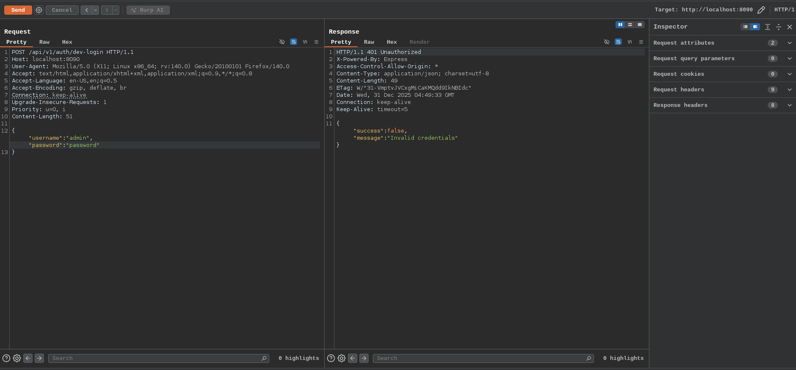
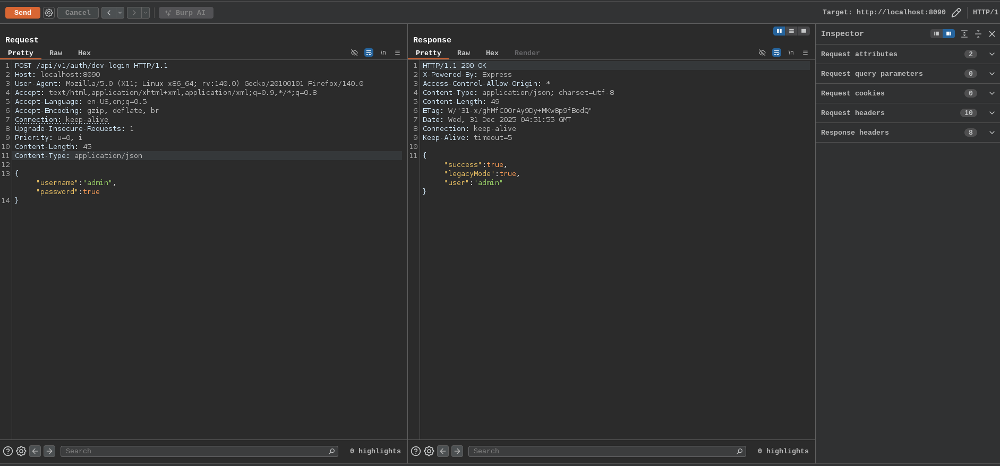
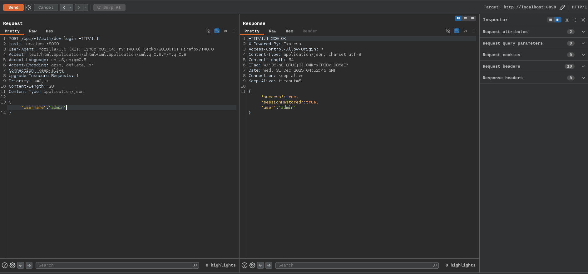

# Authentication Bypass

Authentication bypass occurs when an application fails to properly verify user credentials or access conditions, allowing unauthorized users to gain authenticated access (often as an administrator). Some of the common Authentication Bypass are

## Type Confusion Bypass

The backend likely checks the password using loose comparison (example in JavaScript/Node.js with == instead of ===, or similar weak checks in other languages)
- In many languages, non-empty strings loosely compare as true when compared to the boolean true. So sending "password": true tricks the condition into evaluating as true
- Developers often use loose equality during prototyping, forgetting to switch to strict checks in production

## Empty/Missing Password Field

- If backend does not enforce the presence of the password field in the request
- The code likely assumes the password field always exists and proceeds to validate it, but if it's missing, the validation step is skipped entirely, or it defaults to a value that passes (example empty string matches a default)
- Poor input validation, the server trusts that required fields are present instead of explicitly checking and rejecting incomplete requests

This type of vulnerability highlights how small logic errors in authentication code can lead to complete system compromise