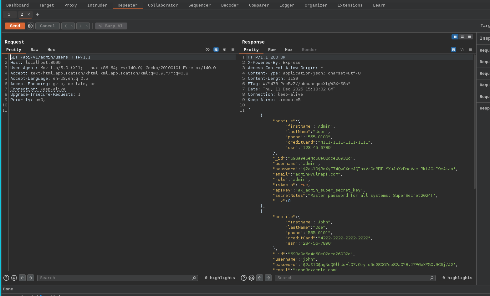
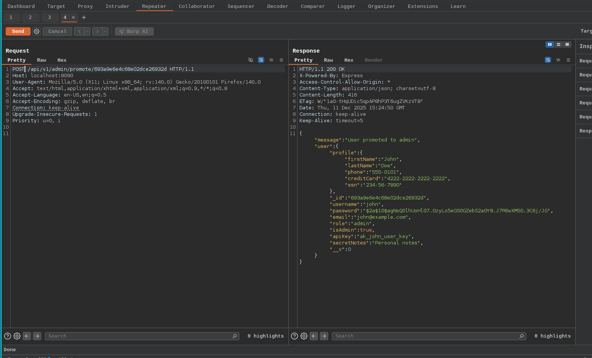
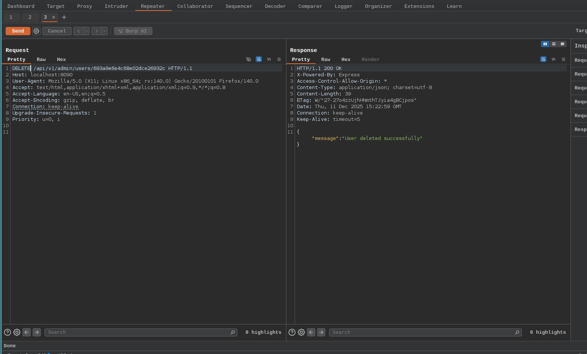

# Broken Function Level Authorization

- Broken Function Level Authorization (BFLA) is a security vulnerability that occurs when an application particularly APIs fails to properly enforces the authorization checks for specific functions,endpoints, or resources
- This allows unauthorized users such as regular users or even anonymous users to access or execute functionalities they shouldn't have permissions. Unlike authentication, which verifies the identity of the user, authorisation determines what resources or action that particular user can access
- BFLA happens when the application assumes that simply hiding certain endpoints (example not linking to them in the UI) is sufficient security,but neglects to implement backend checks. Attackers can exploit this by guessing or manipulating API calls to access restricted features, leading to the unauthorised access

Here in our lab scenario there contains three admin level API endpoints can be seen by the api documentation

1. View all users: /api/v1/admin/users
2. Promote user to admin: /api/v1/admin/promote/<id>
3. Delete a user: /api/v1/admin/users/<id>

---

1. **Viewing all the user**

The endpoint /api/v1/admin/users is intended only for admin users to retrieve all user information. However in this lab implementation, no authorization check is performed, allowing regular users or attackers to access all user data by using the `GET` request

2. **Promote admin**

By sending a `POST` request to /api/v1/admin/promote/<id> promotes a normal user to admin level user. Because the endpoint does not check whether the requester is an admin and even an attacker can promote themselves or others to admin

3. **Deleting User**

Only an admin should be able to delete users using the endpoint /api/v1/admin/users/<id> with the `DELETE` method. Due to missing authorization checks, attackers can delete any user simply by calling the endpoint with an ID

