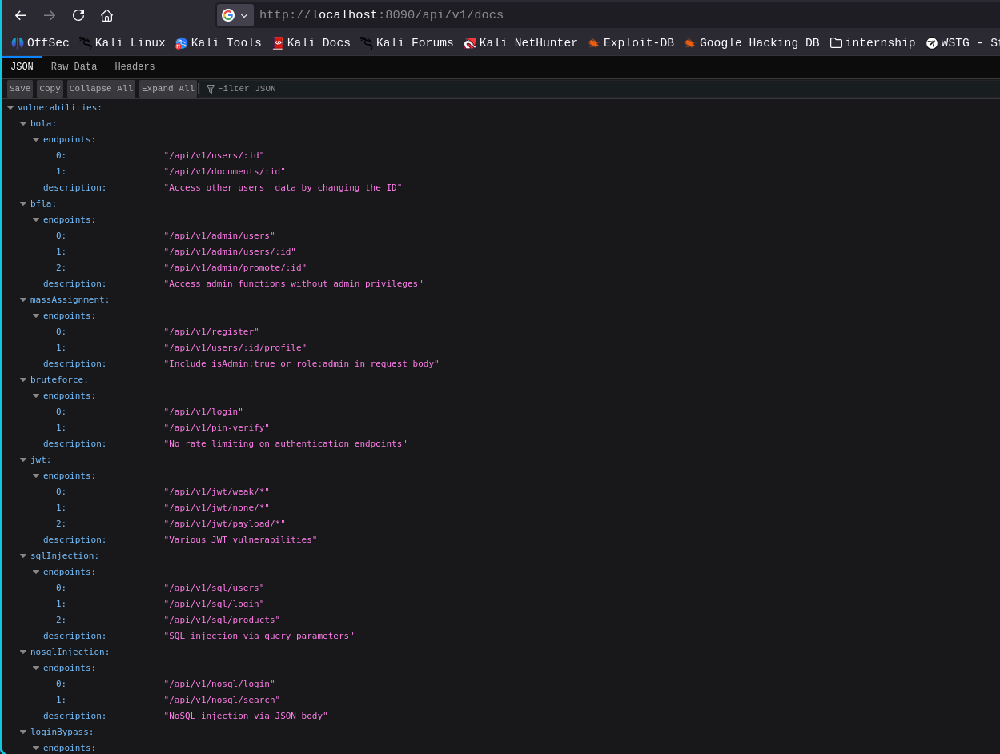
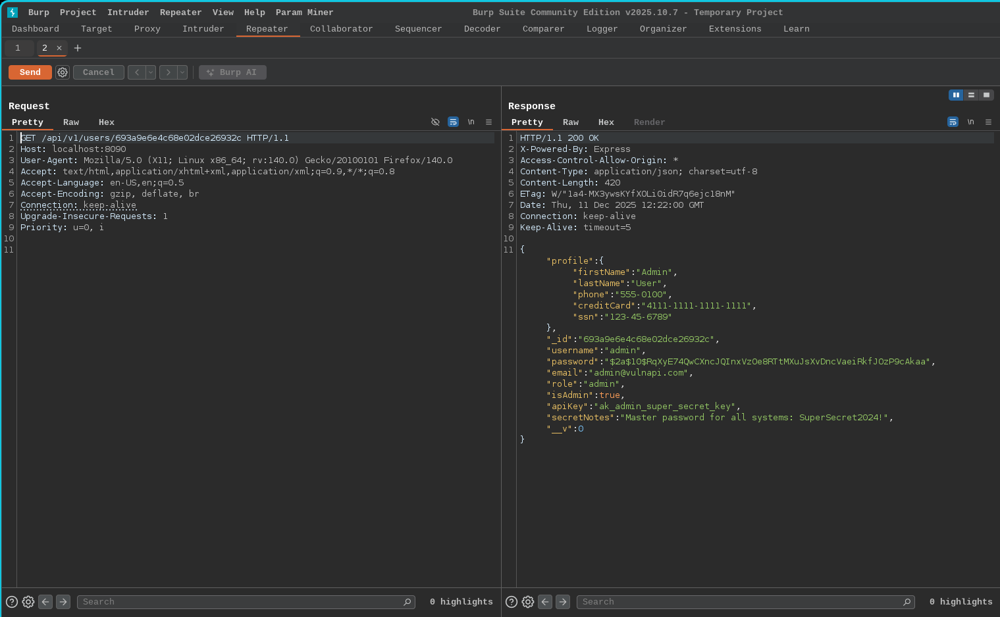

# Broken Object Level Authorization (BOLA)

- Broken Object Level Authorization (BOLA) also commonly known as Insecure Direct Object Reference (IDOR) is one of the most critical vulnerabilities in modern APIs. This vulnerability occurs when an application fails to properly enforce authorization checks at the object level, meaning it does not verify whether a requester is allowed to access a specific resource
- In simple terms, a BOLA vulnerability allows an authenticated (and sometimes even unauthenticated) user to access data that belongs to someone else by guessing or manipulating object identifiers in API requests. These identifiers may be exposed through URLs, query parameters, headers, or request bodies. Common examples include user IDs,account numbers,document IDs,or file paths
- Because many APIs directly reference internal objects without validating ownership or permissions, the responsibility of security is unintentionally shifted to the client side which cannot be trusted. As a result an attacker can modify an identifier in the request and retrieve sensitive information that should be inaccessible

## Role of Documentation Leakage

- In many real world cases,developers leave internal API documentation (such as Swagger,OpenAPI specs,or Postman collections) exposed on production servers. These documents often contain complete maps of the API endpoints,including request/response structures
- In our lab scenario, such documentation was exposed, revealing all available API routes. This significantly reduced the effort required to identify vulnerable endpoints and understand how the application manages resources

Here in `Lab application BOLA vulnerability` exists in /api/v1/users/<id> Endpoint

- The endpoint allows retrieval of user information by supplying a user identifier.The application does not verify whether the requester has permission to access the specific user object. Although the user IDs appear strong,another vulnerability (BFLA – Broken Function Level Authorization) allowed us to enumerate all user IDs which we will discuss in the next module
- As a result,by sending requests with these discovered IDs through Burp Suite,we could access highly sensitive information belonging to other users

The exposed data included:

- User profile details
- API keys,passwords
- Roles and privileges
- Other confidential data

In weaker implementations, identifiers are often predictable (e.g., incremental integers like 1,2,3) making exploitation even easier

> Notes:
> In real world applications developers typically avoid exposing `sensitive information` directly in the frontend. Modern frontend applications usually display only the essential data, meaning even if an API returns a large amount of information, the frontend UI might only show a small, filtered portion to the user. However this doesnot mean the sensitive data is safe because the frontend cannot be considered as a security barrier, the complete response from a API can be seen in tools like Burp Suite, curl or Postman which exposes all the information fetched by the API