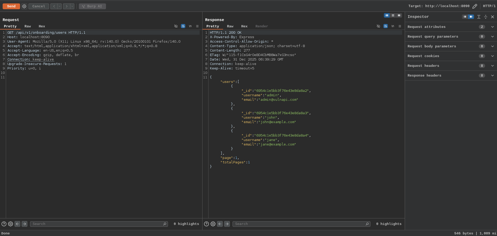
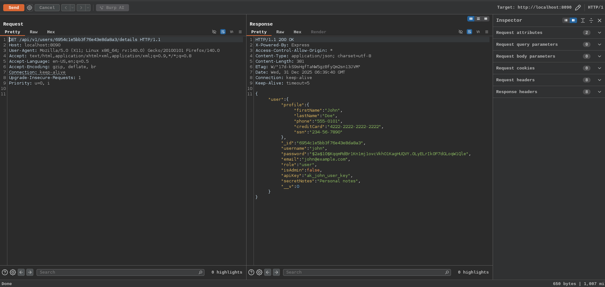
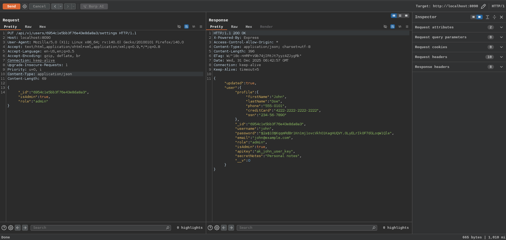
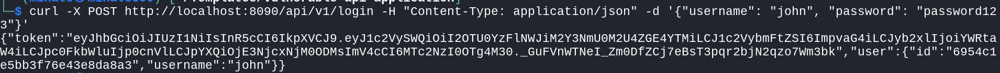
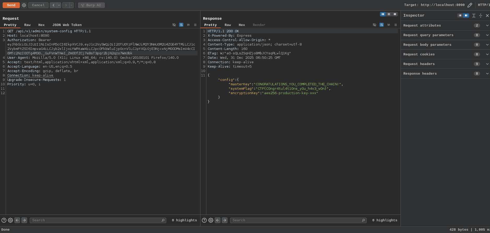

# Chain of Vulnerabilities

Chaining vulnerabilities (also called vulnerability chaining or composite attacks) occurs when an attacker combines multiple lower-severity vulnerabilities in an API to achieve a high impact exploit, such as remote code execution (RCE), data theft, or full account takeover. Individually, each vulnerability might be minor or hard to exploit, but together they form a dangerous attack chain

- Step 1: Starting from BOLA vulnerabilities we are able to extract the user_id for a user. In real world we have register option where we register a account start the testing from these accounts. But here in this lab we already have a default users with their credentials

Now get the user without a admin privilege to make them high privilege like john's id from the endpoint `/api/v1/onboarding/users`.

- Step 2 : confirming the user privileges in the end point `/api/v1/users/:id/details`. After collection the information from the endpoint we able to confirm there is isAdmin, role field is making the difference between the admin and user permission

- Step 3 : We have already know the mass assignment vulnerability which API binds user input directly to internal objects/models without proper filtering, allowing attackers to modify fields that should be protected which could change the role and isAdmin fields. Now making a `PUT` to the endpoint `/api/v1/users/:id/settings` which is vulnerable to the mass assignment to change the fields

- Step 4 : Now we can access the various admin priveleged pages, permission. Example in the endpoint `/api/v1/admin/system-config` which is only accessible by the admin, can now accessed by the john

For the authorisation we need the JWT token to access the admin endpoints. In the database we have modified the user john as admin so the JWT token forged from the server side also contains the token with admin level privileges. Now get the token from login endpoint

Now with we can access the admin pages with JWT token as authorisation

