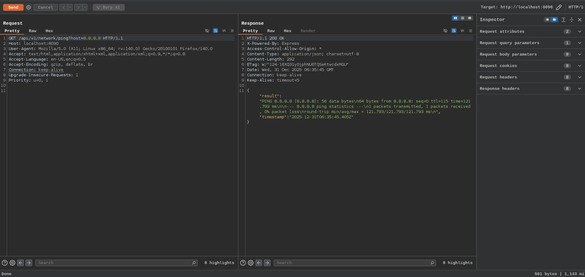
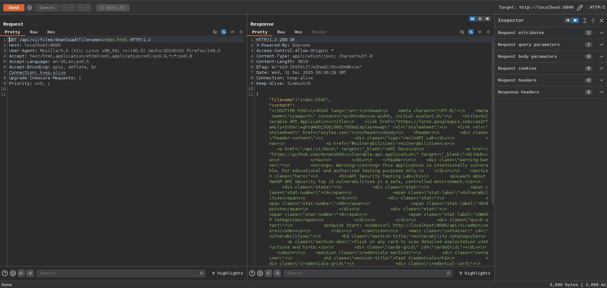
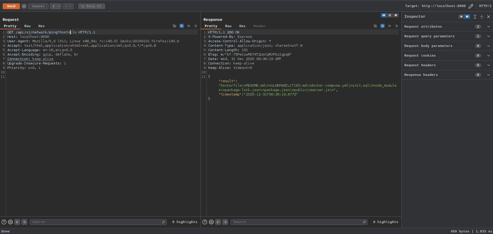
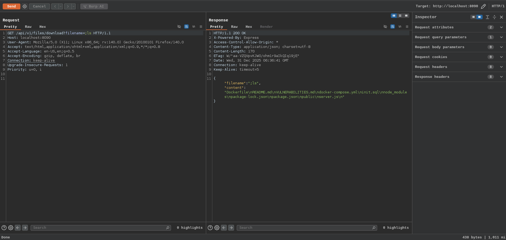

# Command Injection

Command Injection (also known as OS Command Injection) is a critical vulnerability where an attacker executes arbitrary operating system commands on the server hosting the API. It occurs when user-supplied input is unsafely passed to system shell commands (example system(), exec(), popen() in various languages)

**How It Happens in APIs**

APIs often perform server side operations like:

- Generating PDFs/images (example using wkhtmltopdf, imagemagick)
- Pinging hosts (ping command)
- Video processing (ffmpeg)
- File operations or integrations with system tools

If the API directly concatenates user input into a shell command without sanitization, attackers inject malicious commands which leads to the unauthorised access to system or server

**Common separators to chain commands:**

- ; - Run next command unconditionally
- && - Run if previous succeeds
- || - Run if previous fails
- $(command) or backticks - Command substitution
- Newline (\n) in some cases

**Real-World Impacts**

- Read sensitive files (/etc/passwd, config files, env variables)
- Execute reverse shells
- Delete data or ransomware
- Network reconnaissance (nmap, curl)
- Privilege escalation

Here in the lab case we have two endpoints:

- `/api/v1/network/ping?host=` -> Network ping utility
- `/api/v1/files/download?filename=` -> File download service

In these vulnerable APIs, attackers exploit OS command injection by terminating the intended command with a semicolon `;` and appending a malicious one. The semicolon acts as a command separator in most Unix-like shells, forcing the system to execute whatever follows as a separate command

