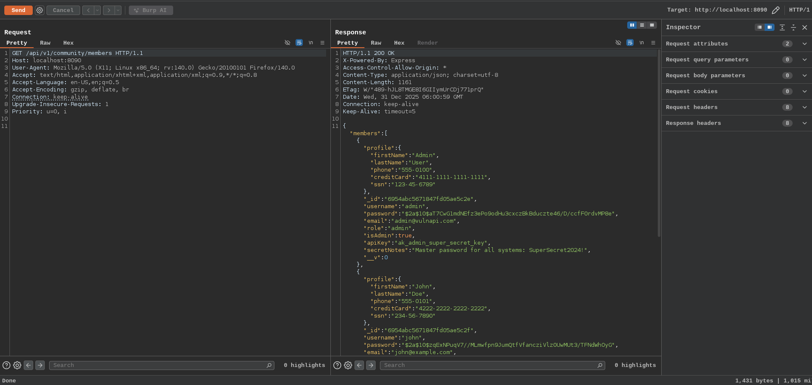

# Excessive Data Exposure

- It occurs when an API endpoint returns more sensitive or unnecessary data than the client actually needs, exposing information that attackers can exploit
- Unlike traditional web apps where the frontend filters data before display, modern APIs (especially REST/JSON-based) often return raw data from the database or backend services. If developers don't explicitly filter or restrict fields, clients receive everything, including internal details meant to stay hidden

**How It Happens**

- Backend fetches a full object/document from the database
- The entire object is serialized and sent in the JSON response
- No filtering, masking, or access-control checks on individual field

By making a GET response to the endpoints given in the lab reveals more confidential information. Here In the lab I have not don't any Frontend for excessive data exposure. But in the real world application the frontend filters the confidential informations so we need to check the API response using Burpsuite, browser or curl to make request directly to the endpoint

similarly the endpoints `/api/v1/account/profile/:id`, `/api/v1/orders/history` also exposes the confidential informations

> Note:
>The Frontend filters the data that should be display but that doesn't mean the data are protected. Simple curl or checking backend responses leads to the sensitive informations