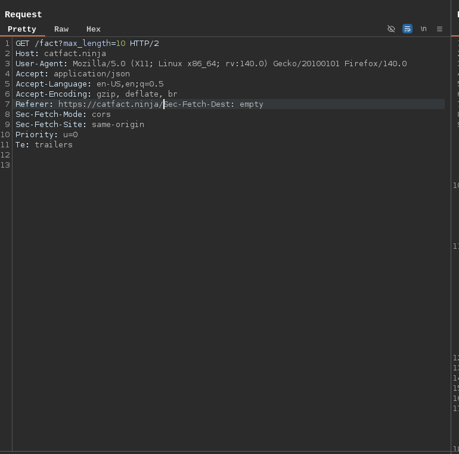
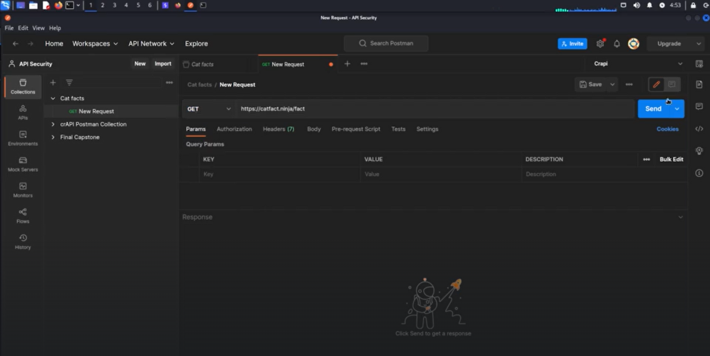

# What is an API?

API stands for `Application Programming Interface`. In simple terms, an API acts as a mediator between different software applications, allowing them to communicate and share data with each other by defining clear rules and protocols.

```
# example api structure

/login  <--|                         |-->  /update
           |          -----          |
/delete <--|---------| API |---------|-->  /logout
           |          -----          |
/send   <--|                         |-->  /purchase
```

## Interacting with APIs for finding vulnerabilities

To discover the full API structure and identify potential security flaws (attack surface), we need to interact with these endpoints. Here are the most common and effective tools/methods:

1. `Burp Suite`

- Burpsuite used to intercept,view,modify,and replay HTTP/S requests
- Map the entire API structure automatically
- Test for vulnerabilities like Broken Object Level Access Control (BOLA),Broken Function Level Authorization (BFLA),mass assignment,injection,and many more. We will use burpsuite frequently 

Example: Proxy your traffic through Burp and visit [catfact](https://catfact.ninja/fact) to capture and manipulate requests

here `max_length` is the parameter for the api endpoint and there are more api endpoints in an applications which may vulnerable so find these endpoints are essential



2. `cURL`

- Command-line tool to make raw HTTP requests. Great for scripting and quick testing

```
curl -X 'GET' \
  'https://catfact.ninja/fact?max_length=10' \
  -H 'accept: application/json' \
  -H 'X-CSRF-TOKEN: <csrf-token>'
```

3. `Postman`

- User friendly GUI tool to explore,document,and test APIs
- Save collections of requests
- Automate tests with scripts
- Share API documentation easily



4. `API Documentation` (if available)

- Some website contains api document for the developer references but it is not removed later which could map the entire api endpoint surface unintentionally (like in endpoints /swagger,/api-docs,/docs,/api/v1/,etc)

5. `Source Code / JavaScript Files`

Viewing the source and the JavaScript files also gives more informations about the endpoints

## Types of API

I. REST APIs

- It is also know as RESTFULL APIS. REST stands for Representational State Transfer
- Statelessness so that each individual request is understood by the server
- Cacheability
- Layered system
- It uses the standard HTTP methods (GET,POST,etc) and conversions and making it a widely adopted and lightweight approach for building modern web service
- Client-Server architecture
- Use of URIs to identify resources

II. Public APIs - It can be use by anyone and interacted with. Example Google maps API,Twitter API

III. Partner APIs - It can be share between a number of companies for example essential bank publish data for other banks

IV. Private API - Only used by an organisation. For example a organization uses a API to govern for authorisation, authentications, etc

`Endpoint` is specific URL that represents resource of service that can access by making request to that URL

**Methods for the APIs:**
1. GET - retrieves the data or a representation of a specificied resourses from server 
2. HEAD - indentical to GET method but it without the response body and only retrieves HTTP headers (metadata) from the server
3. POST - request method used to send data to a server to create or update a resource
4. PUT - method to creates a new resource or replaces a representation of the target resource with the request content.
5. DELETE - method used to request that the origin server remove the resource identified by the Request-URI
6. CONNECT - method request to asks an intermediary proxy server to establish a transparent two-way network connection (a tunnel) to a destination server on behalf of the client
7. OPTIONS - used by a client to determine the communication options and capabilities supported by a server for a specific resource or for the server as a whole
8. TRACE - used to loops a request back to the client, showing exactly what the server received, including headers, for debugging or testing the request path
9. PATCH - used for partial updates to a resource on a server

> Notes:
> - POST is primarily used to create a new resource when the client does not know the final URL. The server is responsible for generating a unique ID and URL for the new resource
> - PUT is used to update or replace a specific existing resource at a known URL. The client specifies the exact URL of the resource they are modifying or creating
> - PATCH is used for partial updates to a resource on a server, meaning you only send the specific data fields you want to change, not the entire resource

