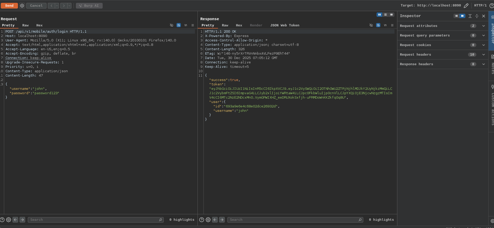
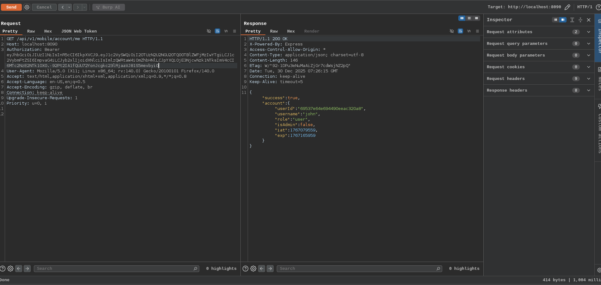
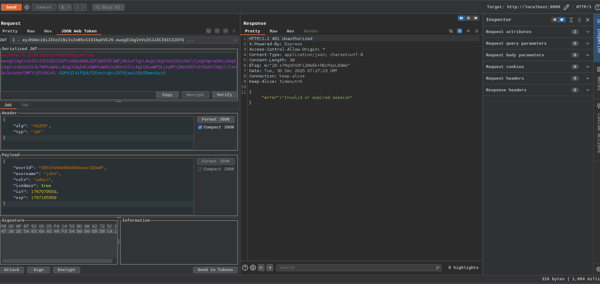
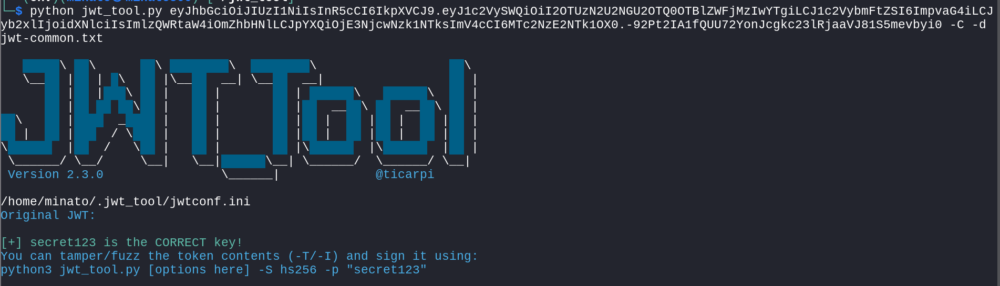
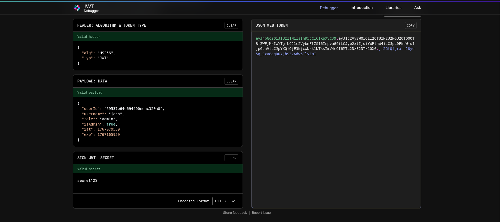
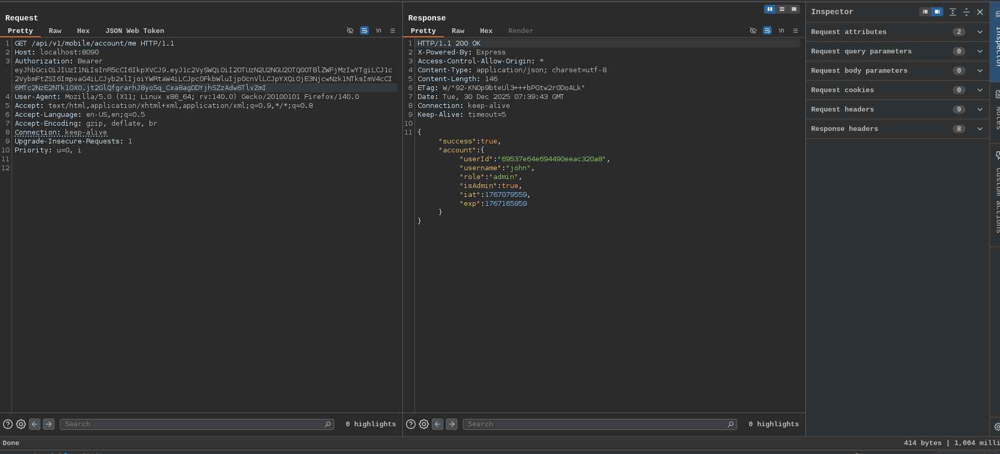
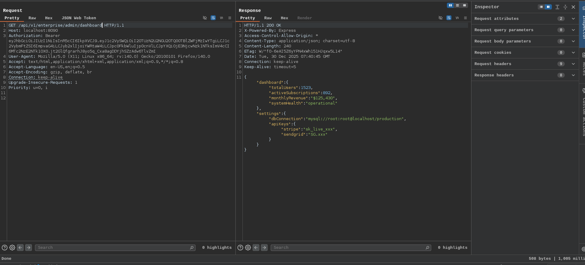
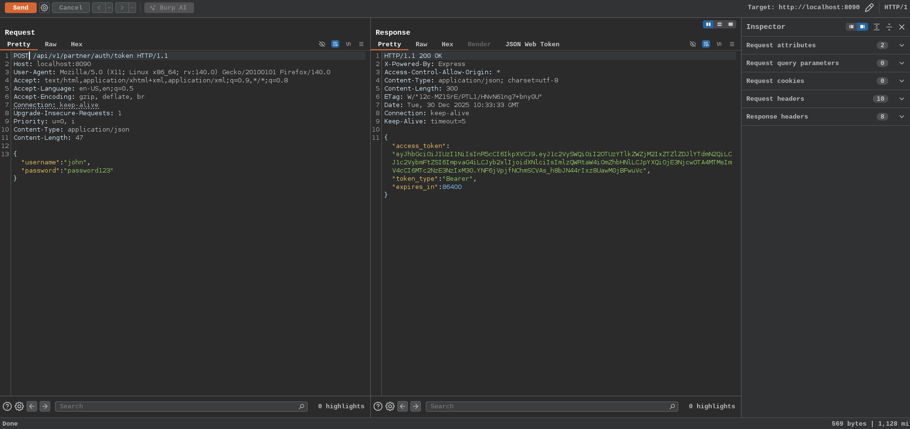
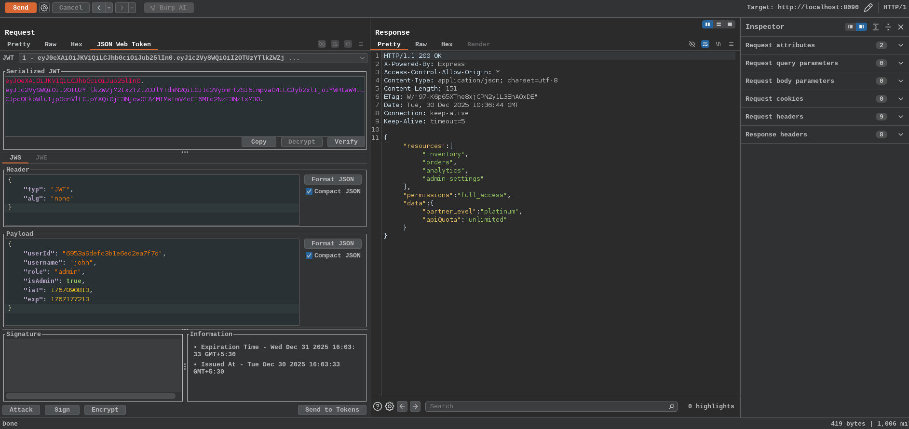

# JWT Attacks

JSON Web Tokens (JWT) are a compact, self-contained way to represent information between two parties, typically used for authentication and authorization in web applications. 

A JWT is a string composed of three parts: Header,Payload, and Signature,separated by dots `.` and it is encoded in Base64

- Header: Contains metadata about the token, like the algorithm used (e.g., HMAC SHA256 or RSA)

```
{
  "alg": "HS256",
  "typ": "JWT"
}
```
- Payload: Contains the claims, which are statements about an entity (example user) and additional data. Claims can be:
1. Registered claims: Standard fields like iss (issuer), sub (subject), exp (expiration time), iat (issued at)
2. Public claims: Custom fields defined by the application (example name, role)
3. Private claims: Custom fields shared between specific parties

```
{
  "sub": "1234567890",
  "name": "John Doe",
  "iat": 1516239022
}
```

- Signature: Ensures the token’s integrity. It’s created by encoding the header and payload, then signing them with a secret key (or private key for asymmetric algorithms)

**Risk of weak secret key of JWT token**

When using symmetric algorithms like HS256 (HMAC-SHA256, the most common for JWTs), the security of the token relies entirely on the confidentiality and strength of the shared secret key. If the secret is weak (short, predictable, dictionary word, hardcoded default), an attacker who obtains a valid JWT can crack the secret offline via brute force or dictionary attacks. Once cracked, they can forge unlimited valid tokens (e.g., as admin)

---

## JWT Weak Secret

Here the secrect key for the JWT token is weak and can be bruteforced for the valid secret key.

Now we need to get the valid JWT token to crack the secret so we have a john credentials to generate a valid JWT tokens



After getting the valid JWT token send to the account info endpoint to get more about the account we have



Now we found that user john contains the role user so if we able to find the JWT secret key then we can forge the user as admin



using the [JWT_tool](https://github.com/ticarpi/jwt_tool) we can bruteforce the JWT token if the token forged from weak secret key with the wordlist contains in the JWT_tool and we found the secret key is `secret123`

```
python jwt_tool.py <token> -C -d wordlist.txt
```



Now forge the JWT token for the john user with the role as admin using [jwt.io](https://jwt.io)



Now we can login with the token as admin, these token can also make as to access various admin endpoint





## JWT Algorithm None 

Some time the application does not check the signature based on the header algorithm in JWT token based on that the attacker can exploit it by using none algorithm which doesn't check the signature. Here after changing the alogorithm to none in JWT header remove the signature and pass the token this makes the token as valid

Changing the header to {"alg": "none", "typ": "JWT"}

Step 1 : Get the valid token 



Step 2 : Change the role as admin and change the algorithm it makes the token as valid with admin access (In burpsuite JSON web token extension is useful)



## JWT Privilege Escalation

it is the same as the JWT Weak Secret only the endpoints differs