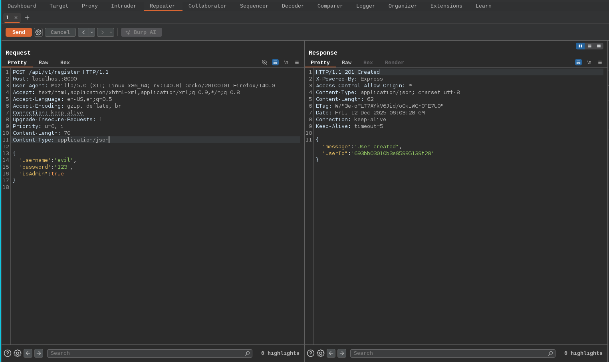
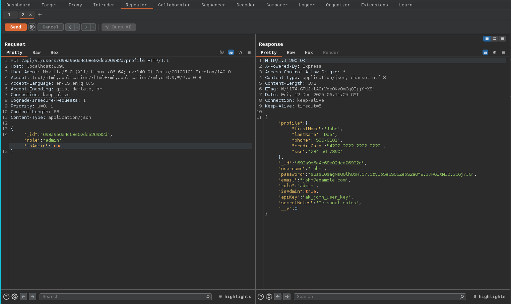

# Mass Assignment

- Mass Assignment is also referred to over posting or autobinding, is a vulnerability that arises in the web applications and APIs when user input from HTTP requests (such as form data or JSON payloads) is automatically mapped to internal object properties or database model fields without adequate restrictions or validations. This feature is common in many web frameworks (like Ruby, etc) as a convenience for developers allowing quick assignment of multiple attributes at once.
- However it becomes security issue when sensitive or unintended properties can be modified by clients, potentially leading to unauthorised access,privilege escalation and data tampering
- The core problem stems from the lack of distinction between user controllable inputs and internal,protected fields. If an API endpoint expects only a few fields like `username` and `email` but blindly assigns all provided parameters to a user object, an attacker could include additional fields like `isAdmin` or `role` to elevate their privileges

In our lab scenario there has two API endpoints

1. Can register as admin in the endpoint /api/v1/register
2. Can change the role in /api/v1/users/user_id/profile

---

1. **Registration Endpoint**

`/api/v1/register` - Allows attacker controlled data to be bound directly to a user model. If the backend does not explicitly restrict fields, an attacker can register themselves as an admin by adding privileged attributes (example "isAdmin": true,role: "admin")

2. **Profile Update Endpoint**

`/api/v1/users/<id>/profile` - Intended for updating basic user information. If mass assignment is enabled without proper authorisation checks, attackers can modify protected fields such as "role" even after registration

> Note:
> If a request is sent without the correct `Content-Type` header,Server running on express does not know that the body contains JSON. Because of it the express.json() middleware will not parse the body and req.body will be empty. So the `Content-Type: application/json` header must be included so the server can correctly parse the body as JSON