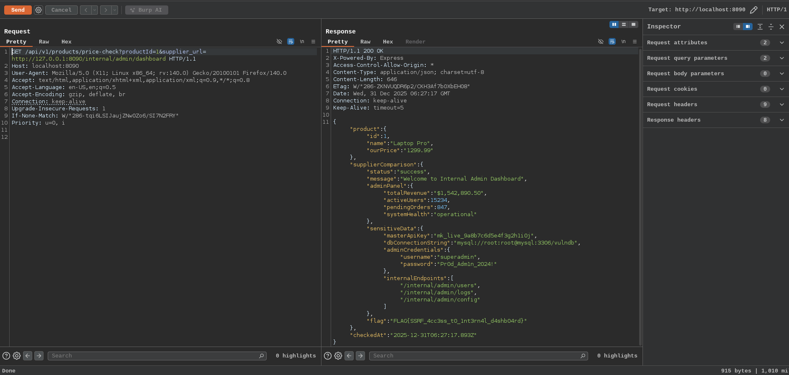

# Server Side Request Forgery

Server Side Request Forgery (SSRF) is a web security vulnerability that occurs when an API or web application fetches a remote resource based on user supplied input (example a URL) without properly validating it. This allows an attacker to trick the server into making unintended HTTP requests to arbitrary destinations, including internal networks, localhost, or restricted external systems

**SSRF is particularly dangerous in APIs because modern APIs often integrate features like:**

- Fetching images or files from user-provided URLs (example profile pictures)
- Webhooks (sending data to user-specified endpoints)
- URL previews, imports, or integrations with external services

Many WAFs and filters block obvious localhost strings like 127.0.0.1 or localhost, but fail against alternative IP representations (decimal, octal, hex, etc). The backend URL parser often resolves these to the real IP, evading regex-based checks
Key Localhost (127.0.0.1) Bypass Payloads

```
Decimal (dotless): http://2130706433/
Octal (dotted): http://0177.0.0.01/ or http://017700000001/
Hex (dotted): http://0x7f.0x0.0x0.0x1/ or http://0x7f000001/
Mixed: http://0x7f.0376.0.1/
Shortened: http://127.1/ or http://127.0.1/
IPv6: http://[::1]/ or http://[0:0:0:0:0:ffff:7f00:1]/
URL-encoded: http://%31%32%37%2e%30%2e%30%2e%31/
```

## Why Authentication is Bypassed in Internal SSRF Requests

Internal services (example localhost admin panels, microservices, cloud metadata) often trust requests from the server itself:

- Source is trusted: Requests come from loopback (127.0.0.1) or internal IP - treated as privileged
- No auth required: Many internal endpoints skip authentication when source is the app server (assumes only the server can reach them)
- No user session: SSRF requests don't carry user cookies/tokens, but that's irrelevant when auth isn't enforced internally
- Network protections bypassed: Firewalls allow server-to-internal traffic freely

`Result`: Attacker forces the server to access protected internal resources as a trusted insider

Here in our web application the endpoint `/api/v1/products/price-check` contains the supplier_url which is vulnerable aganist SSRF so this endpoint would able to make the internal requests

