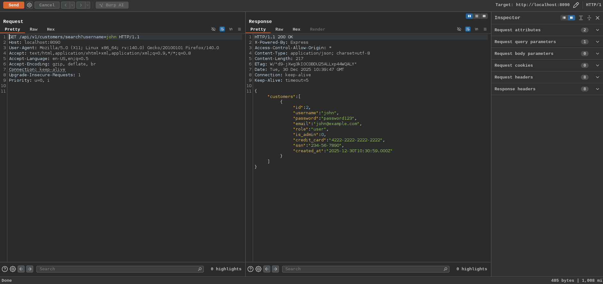
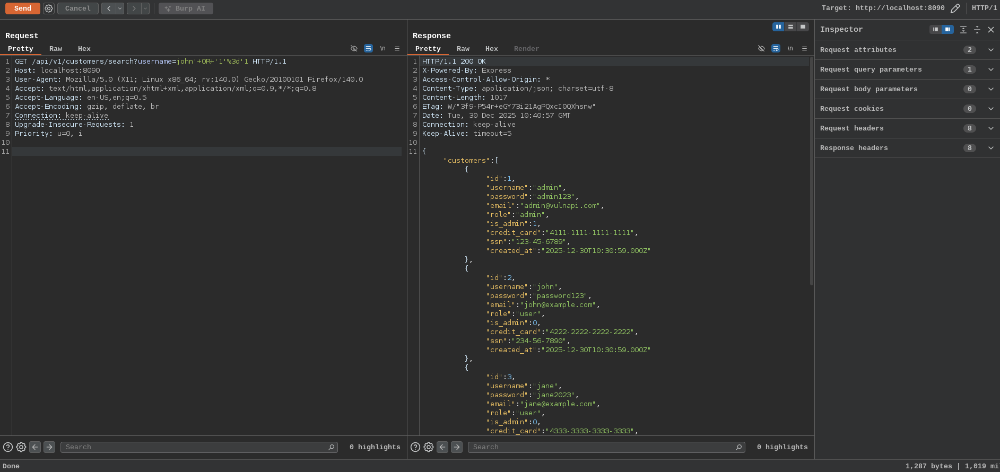
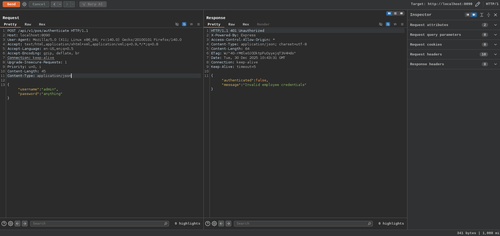
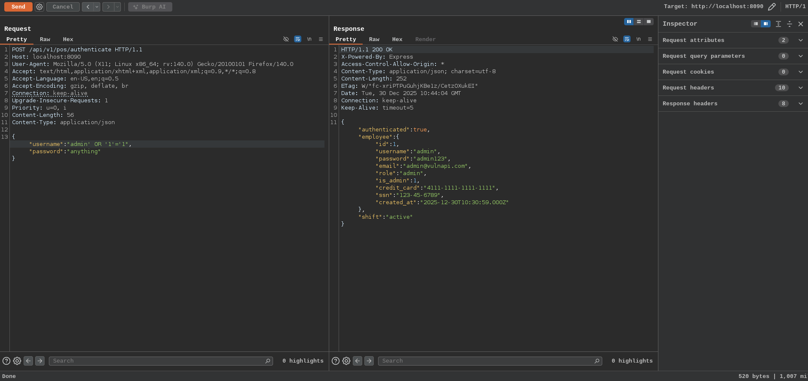
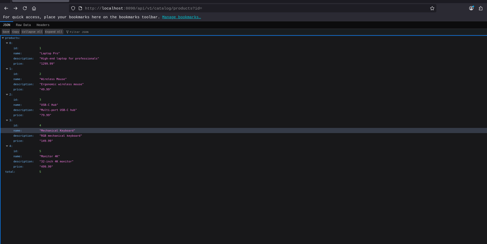
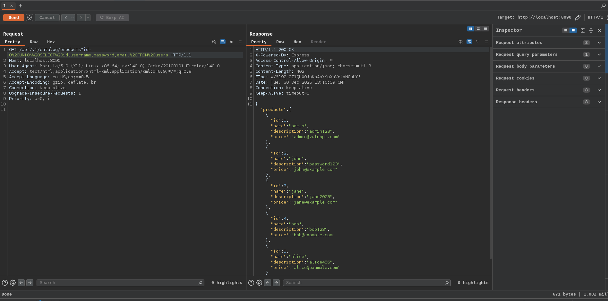

# SQL Injection

SQL injection (SQLi) is a common vulnerability that affects APIs just like traditional web applications. It occurs when an API endpoint accepts untrusted user input (example from query parameters, JSON body, headers, or path parameters) and directly incorporates it into a database query without proper sanitization. This allows attackers to manipulate the SQL statement, potentially bypassing authentication, extracting sensitive data, modifying records, or even deleting databases


APIs often interact with databases via backend queries. For example, consider a REST API endpoint for fetching user data:

```
GET /api/users?id=123
```

- Backend might construct a query like: `SQLSELECT * FROM users WHERE id = '123';`
- An attacker could inject malicious input: `GET /api/users?id=123' OR '1'='1`

---

Here in the endpoint `/api/v1/customers/search?username=` we can get the informations of the user specified but here it retrieve sensitive information like password because this application is intensional vulnerable, in real world it only retrieves needed information but still the sqli can retrieve other users information (common payload can be used like `' OR '1'='1`)





Another endpoint point `/api/v1/pos/authenticate` which used for authentication like login pages this could arises common in real world application where it commpletely trust the user input and result the attacker could able to inject the malicious queries to get unauthorized access





The endpoint `/api/v1/catalog/products?id=` is used to retrieve the product informations from a sql database and if the input from a user is not sanitized it makes the attacker to inject union-based sql injection which would retrieve the confidential and sensitive information in other tables

First, the attacker must determine the number of columns returned by the original query. This is necessary so that they can craft a UNION-based payload with the exact same number of columns

In a UNION-based SQL injection attack:

- The UNION operator combines the results of two (or more) SELECT queries
- For the combined query to execute successfully, both the original query and the injected query must return the same number of columns
- The data types in corresponding columns must also be compatible (though NULL is often used in testing because it's compatible with most types)

Here we able to see there are four column that are retrieved



Now inject the union based sqli, then it reflect with the sensitive informations



> Note:
> In Burp Suite, we must manually URL-encode special characters and spaces in parameters when testing API endpoints, whereas browsers automatically handle this encoding for us