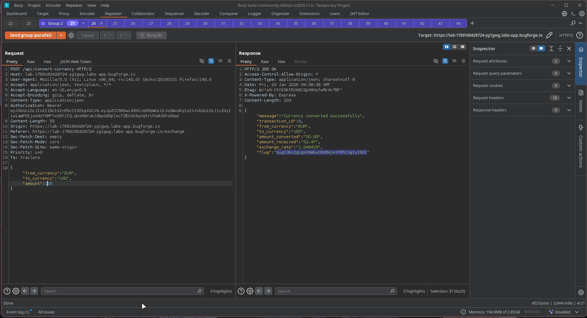

# Shady Oaks Financial

This challenge contains a trading application with around 10 to 12 API endpoints. Initially, I tested each endpoint one by one to see if any of them could be abused for example, endpoints that might allow a user to become an admin or gain extra currencies for trading

I got stuck at that point, but then I received a hint on Discord suggesting that the lab was vulnerable to a race condition. After that, I shifted my focus to identifying which API endpoint could be affected by a race condition

Eventually, I discovered that the currency exchange API endpoint was vulnerable. By sending multiple requests in parallel, I was able to exploit the race condition and obtain the flag

