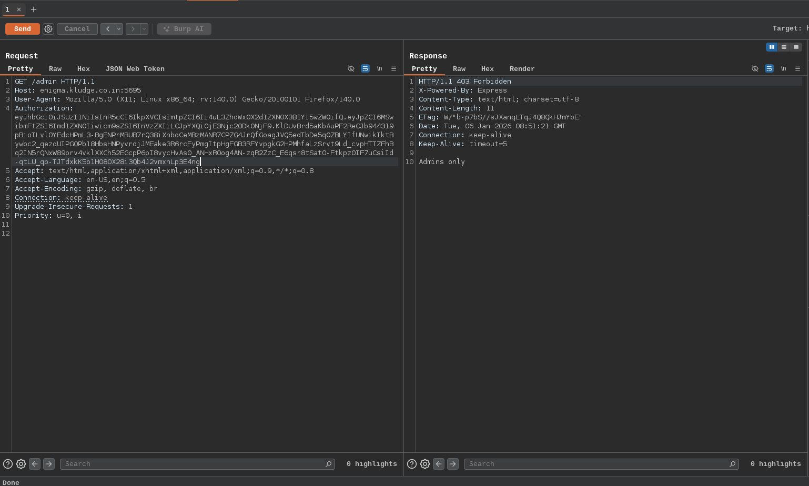
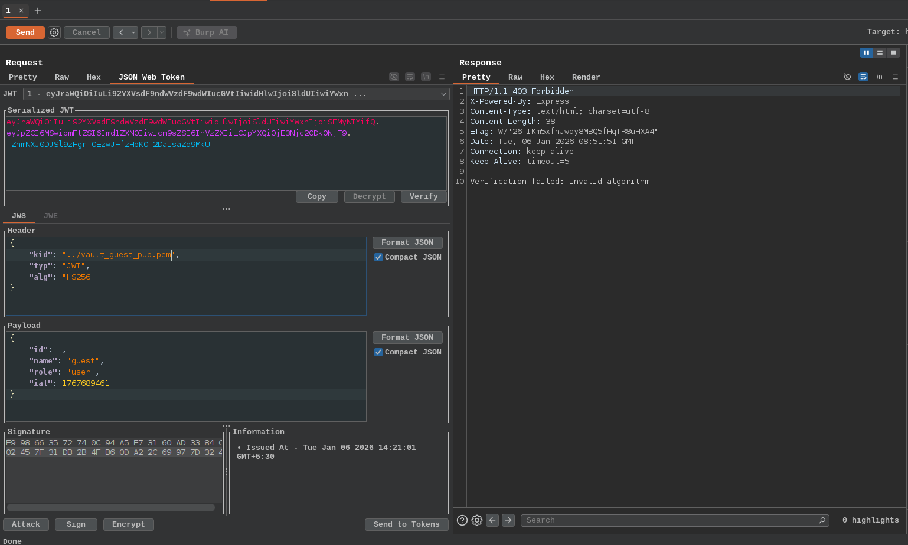
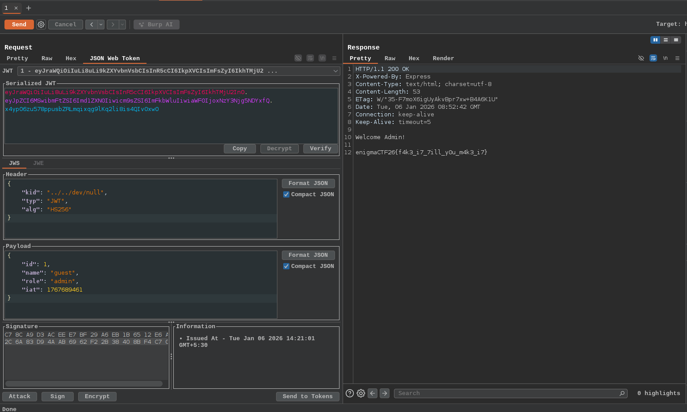
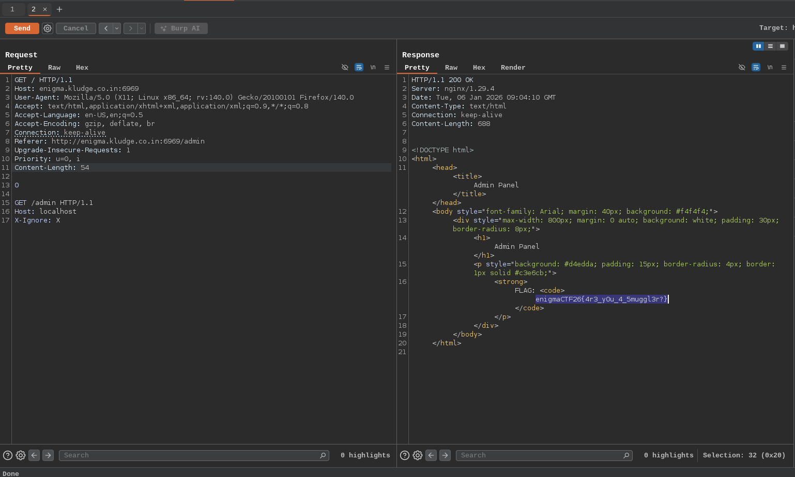
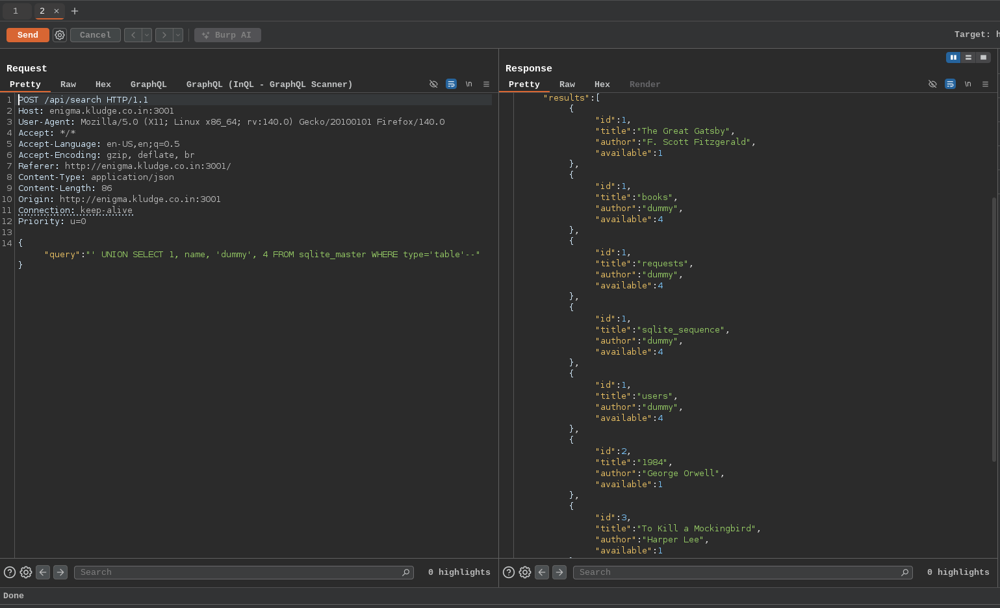
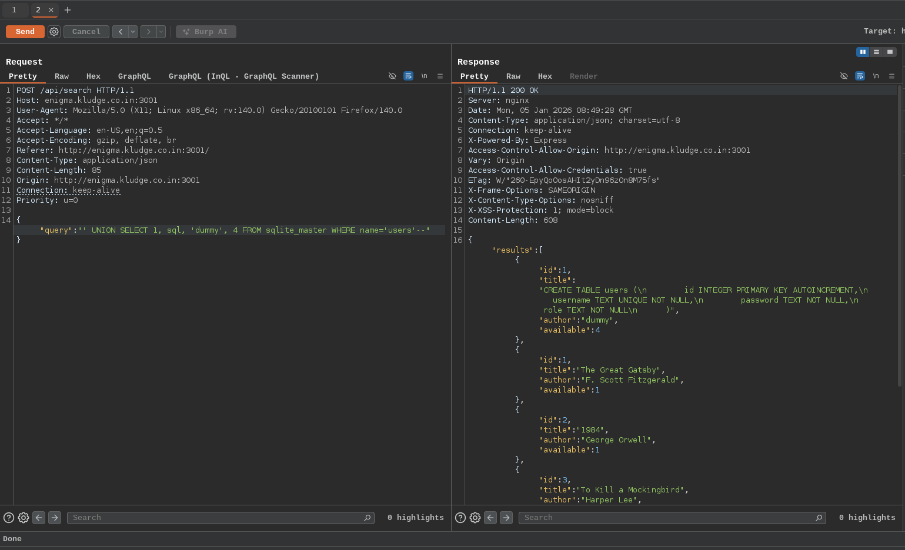
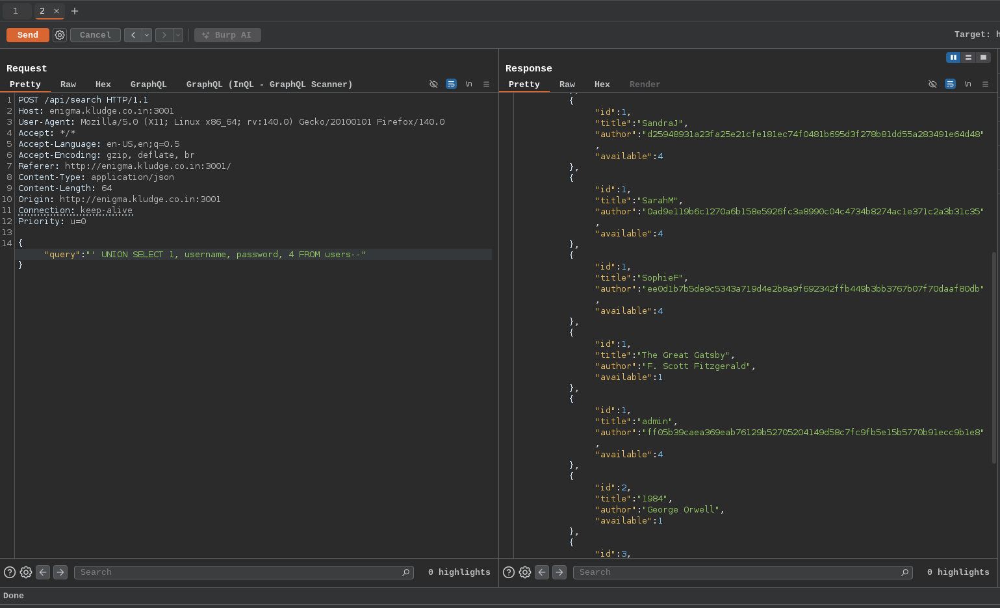

# EnigmaCTF 2026

## Vault

In the challenge, I have a `\login` where i get a token for the guest account with this i have to forge a ticket for admin to visit the `\admin` endpoint. 

With the token when i access to the \admin panel, it says only admin allowed

When I decode the token with the JSON Web Token extension in Burp Suite. In the decode it uses the kid, that is key from a folder and role as user. When I change the role to admin also it might fail because the signature with the key make it invalid token

So I changed the signing algorithm from its original value to HS256 (HMAC-SHA256). Unlike asymmetric algorithms, HS256 uses a symmetric key, meaning the same key is used for both signing and verification. I made the kid to point `/dev/null`, On Unix-like systems, /dev/null resolves to an empty input. This effectively causes the server to use an empty key for signature verification and made the signature by empty secret key using the JSON Web Token. Finally when I visit the /admin endpoint with the forged token i have abled to get the flag

---

## Compromised

Here the `\admin` endpoint contains the flag but it is accessible only by the internally. In this challenge, there were lots of blog which contained a topic for HTTP Request Smuggling. So there is a possible a hint for it

HTTP Request Smuggling is a web vulnerability that occurs when a front end server (proxy, load balancer, CDN) and a back-end server interpret an HTTP request differently, allowing an attacker to `smuggle` a hidden request inside another one

---

## Hijack

This challenge contains a website for a library and to retrieve the flag we need to become a admin. There contains a `/api/search` endpoint which is vulnerable to the SQL Injection. By this we can enumerate the database using the union sqli, In the previous sql query it contains 4 columns so the malicious query also retrieves the same columns

We can retrieve the admin password hash and by cracking it we can login as admin to get the flag

