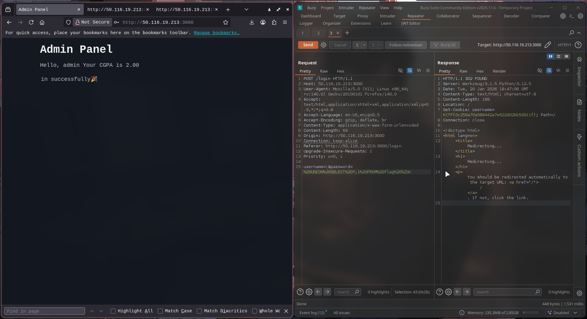

# KnightCTF 2026

## Admin Panel

In this challenge there exist the login page, so I initially started testing with the SQL Injection

- The classical sqli in the username field is not worked `username=admin' OR 1=1 --`
Response: HTTP 400 Bad Request: Not injectable

- This might be a indication of a WAF was filtering requests. Since single quotes were blocked or strictly handled, we attempted to break the query logic using a backslash \ character. The theory was that a backslash in the username field would escape the closing quote of the SQL query (`username=\&password= OR 1=1 #`)

Possible Backend Query for it: `SELECT * FROM users WHERE username='\' AND password=' OR 1=1 #'`

The \ escapes the first closing quote. The database interprets the username as the string: [' AND password=]. The password check is "eaten," and then we can proceeds to union injection to retrieve data from other tables

Using the union sqli we found the existence of a table named flag. Again using the union sqli we can retrieve the flag `UNION SELECT * FROM flag #`

- The injection was successful. The UNION operator appended the content of the flag table to the query results. Since the original user query returned null (due to the backslash trick), the application grabbed the first available result the Flag and treated it as the username.

The flag was displayed on the welcome screen:



## Knight Shop Again

Here in the challenge when we look into the source code, in a javascript file it contains the valid coupon code `KNIGHT25`. Initially I thought it would be a race condition. So I send multiple request with coupon code for ordering a product but unfortunately a single request was enough for the flag, then I checked again. Here coupon code only is enough to get the flag and no other web exploit is needed haha!

When I try again using the same coupon code for second time, it was shown as invalid code then I got looked in the cookie it contains promo_applied 1 to indicate the coupon applied so when you delete that cookie and able apply it again

The other way to solve this challenge is by changing the quantity of the product from 1 to -1. But still there exist lots of ways

## KnightCloud

This challenge is about a enterprise cloud platform, to get a flag we want to access the premium analytics feature in dashboard. Initially we can create a free tier account which contains less feature. By looking into the source code we able to find a classic Client Side Information Disclosure and Broken Access Control vulnerability, that the application has exposed an internal administrative object `__KC_INTERNAL__ `on the global window scope. We can use this to bypass the payment system and force an upgrade

we can make it by post request to the endpoint or else we can use the console to update it. By using the browser console we can update the account to premium to view the flag in the analytics 

```
# Use the exposed internal helper to upgrade your specific user ID and refresh the page
await window.__KC_INTERNAL__.helpers.updateUserTier("ca9fee49-22ae-475a-aaae-b73c155bfc80", "premium");
```

## WaF

Here it uses the Python WAF to blocks directory traversal (..) and URL encoding (%). 

`if ".." in filename or "%" in filename: return "No..."`

The backend might uses curl to fetch the file. We can abuse `Curl Globbing (brace expansion)`.
- WAF Check: .{.} does not contain .. or %.  makes it PASS
- Backend Execution: curl expands .{.} ->  ..

We replace .. with .{.} to traverse to the root. We use --path-as-is to prevent our local client from normalizing the path before sending. Payload: /.{.}/.{.}/flag.txt -> Expands to /../../flag.txt on server

```
curl -v --path-as-is 'http://<ip>:<port>/.{.}/.{.}/flag.txt'
```