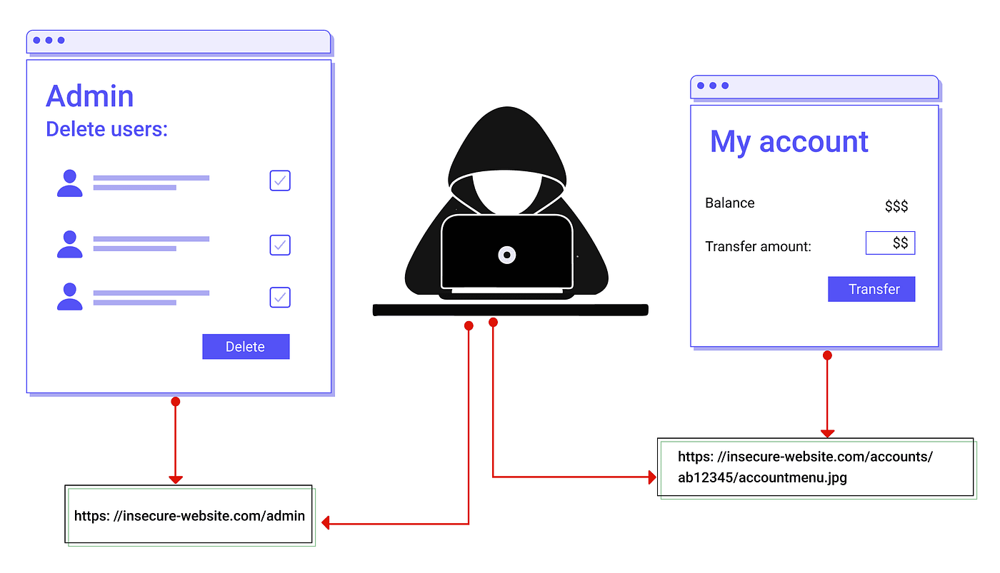

# Access Control Vulnerabilities

Access control is the process on who or what is authorized to perform action or to access a resource. In web application security, access control depends on the authentication and the session management because

- Authentication confirms who is the user (identity of the users)
- Session management identifies which subsequent HTTP requests are being made by the particular user or same user.
- Access Control determines that user is allowed to carry out the action that user is attempting to do 

Broken access controls are common in modern day. Design and management of access controls is a complex and dynamic problem that applies business, organizational, and legal constraints to a technical implementation. Access control design decisions have to be made by humans so the potential for errors is high. Access Control has a set of [security models](https://portswigger.net/web-security/access-control/security-models).

## Types of Access Control

### Vertical Access Control

Vertical access controls are the mechanism that restrict the access to the sensitive resource or functionalities to a specific types of users. With these access control different users have access to different application functions. For example, Admin users would able to manage, modify,delete the user along with lot more functionalities. But the normal users can only manage their profile and data that too with some constrains depending on the web application. It follows the least privilege policy that the user is provided with only the require functionality (action) and access the resource.

### Horizontal Access Control

Horizontal access controls are mechanisms that restrict access to resources to specific users. With horizontal access controls, different users have access to a subset of resources of the same type. For example, a banking application will allow a user to view transactions and make payments from their own accounts, but not the accounts of any other user. It is like the user with the same level has the same functionality to perform action and access resource but they only manage their own.

### Context dependent access controls

Context dependent access controls restrict access to functionality and resources based upon the state of the application or the user's interaction with it.

## Broken Access Control

### Vertical privilege escalation

When an user abled to access the resources or perform the action that they should not do is called as vertical privilege escalation. For example, In a web application were a normal user is abled to access the admin page and perform actions like deletion, modification, updating a existing user by just visit the admin URL.

It arises when admin functionality is not protected based on the user roles. Some developers thinks the admin URL hidden in the web application that the attacker would be able to find it but this assumption fails because the admin URL could found in the javascript code, bruteforce attack, robots.txt (as the developer would think the spider bots should scrap the admin page because it could index by the search engine). The main drawback is they would make only the authenticated users can access the admin functionality (logined user) not the authorised users (admin) could these vulnerability.

Sometimes the application checks the roles while login time and stores in the user controllable location like cookies, query string parameters, or hidden variables. Other possibilities like overwriting the blocked URL using the non standard HTTP Headers which pass the frontend checks but it executed after the request process by the server.

Sometimes misconfiguration too an reason where for a particular group of users are denied to make POST, other HTTP method to certain endpoints but some application frameworks support various non-standard HTTP headers that can be used to override the URL in the original request, such as X-Original-URL and X-Rewrite-URL. Or sometime the attacker can change the HTTP methods which could lead to the unauthorized access.

### Horizontal privilege escalation

It occurs when an user able to access their own resources and the resource of other users of same type. For example in an student management system, a teacher can access their records and the other teacher records.

By changing the `id` parameter a user can abled to access other users accounts this is called as `Insecure Direct Object Reference` where user controlled parameter values are used to access the resources or function directly. Some application uses the globally unique identifiers (GUIDs) to identify users this may prevent the attacker from guessing or predicting the user IDs but this GUIDs may be found in the users review or in somewhere in the application 

## Prevention

- Never rely on obfuscation alone for access control.
- Unless a resource is intended to be publicly accessible, deny access by default.
- Wherever possible, use a single application-wide mechanism for enforcing access controls.
- At the code level, make it mandatory for developers to declare the access that is allowed for each resource, and deny access by default.
- Thoroughly audit and test access controls to ensure they work as designed.