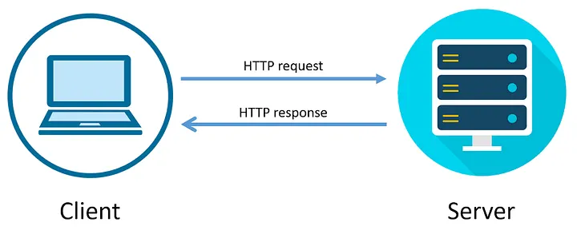

# Introduction to Web Application

To understand web exploitation, you have to speak the native language of the web which is a HTTP (Hypertext Transfer Protocol). Every time you click a link, submit a form, or load an image, or performs an activity in web application an unseen conversation happens between your browser (which acts a Client) and the web application (which acts as a Server)

HTTP (`HyperText Transfer Protocol`) is the communication protocol used for transferring data between a client and a server. When we send data through HTTP the data is send without encryption, it is sent as plain text and the server return response back the same way. In case of https the data is encrypted using TLS or SSL algorithm and change it to cypher text and this cypher text is sent to the server.

<center>
</div></center>

Think of this interaction like you are ordering food at a restaurant.

The Request: You (the client) give your order to the waiter. You specify how you want it (HTTP Method in web), what you want (Endpoint), and any special instructions (Headers/Body)

The Response: The kitchen (the server) processes the order and sends the waiter back. The waiter brings a status update (Status Code corresponding to the request made by the client), the food itself (Body which contains the html code for the web application), and the receipt (Headers)

## Web Request and Response Mechanism:

As we know the little introduction of the request and response, i.e Client using the browser asks for a particular resource like the html page or perform particular action is called the request and the desired output made by the server is called as the response.

### Part 1: The Web Request

An HTTP request is just a block of plain text formatted in a very specific way to the server for a particular resource. As an attacker's primary job is to manually manipulate this text to see if the server gets confused.

A request has four main parts:

I. The Method: This tells the server what action you want to perform.

- GET - retrieves the data or a representation of a specificied resources from server
- HEAD - identical to GET method but it without the response body and only retrieves HTTP headers (metadata) from the server
- POST - request method used to send data to a server to create or update a resource
- PUT - method to creates a new resource or replaces a representation of the target resource with the request content.
- DELETE - method used to request that the origin server remove the resource identified by the Request-URI
- CONNECT - method request to asks an intermediary proxy server to establish a transparent two-way network connection (a tunnel) to a destination server on behalf of the client
- OPTIONS - used by a client to determine the communication options and capabilities supported by a server for a specific resource or for the server as a whole
- TRACE - used to loops a request back to the client, showing exactly what the server received, including headers, for debugging or testing the request path
- PATCH - used for partial updates to a resource on a server

II. The Endpoint

The specific path to the resource on the server (example /api/users/profile).
Attacker Perspective: If I change /api/users/10 to /api/users/11, can I see someone else's datas like email id, phone number, banking financial records? (this is an example of IDOR)

III. The Headers

Extra information about the request, such as what browser you are using (User Agent), the cookies, or what format you accept as some APIs sends the data in the json format (`Accept: application/json` as a header).

Attacker Perspective: Can I inject malicious code into the User-Agent header? If the server logs that header without sanitizing it, I might trigger a stored XSS or SQL Injection or even a remote code execution.

```
# In HTTP Resquest the method and endpoint is in the form
METHOD /endpoint HTTP/1.1

example: 
GET /dashboard.html HTTP/1.1
Host: minato500.github.io             
```

IV. The Body

Used mostly with POST/PUT to send large chunks of data, like JSON payloads or file uploads.

### Part 2: HTTP Status Codes

When the server replies, the very first line contains a three digit Status Code. This is the server's way of quickly summarizing what happened. They are grouped into five categories:

- 1xx - Informational: Rarely seen in standard web hacking. It means "I received your request, I'm processing it, keep the connection open."

- 2xx - Success: The server successfully processed the request.
- 200 - OK: Everything went perfectly. Here is your data.
- 201 - Created: Perfect for POST requests. "I successfully created the user/file you asked for."

Attacker Perspective: During reconnaissance (Dirbusting), finding hidden directories that return a 200 OK (like /admin_backup.zip) is the jackpot.

- 3xx - Redirection :The resource has moved, and the server is telling your browser to automatically go to a new URL.
- 301 - Moved Permanently: Update your bookmarks, it's over there now.
- 302 - Found (Temporary Redirect): It's temporarily over there. (Often used after a successful login to bounce you to the dashboard).

Attacker Perspective: If the server redirects you based on user input (e.g., login?next=[https://evil.com](https://evil.com)), you have an Open Redirect vulnerability.

- 4xx - Client Error: The server is saying, "I can't fulfill this because you made a mistake in your request."
- 400 - Bad Request: Your syntax is malformed (example broken JSON).
- 401 - Unauthorized: You need to log in first. You are missing a valid session cookie or token.
- 403 - Forbidden: You are logged in, but you don't have the permissions to see this (e.g., a standard user trying to view /admin).
- 404 Not Found: The resource doesn't exist.
- 429 Too Many Requests: You are being rate limited.

Attacker Perspective: 403s are gold mines. If /admin gives a 403, it means the directory exists. Attackers will try bypasses like /admin/ or /%2e/admin to trick the server into yielding a 200 OK

- 5xx - Server Error: The server encountered a condition it didn't know how to handle. The application crashed or threw an unhandled exception.
- 500 - Internal Server Error: The application crashed.
- 502 - Bad Gateway / 503 Service Unavailable: The server is overloaded, down, or misconfigured.

Attacker Perspective: A 500 error is an attacker's favorite response when testing for injection. If putting a single quote ' in a username field returns a 500 Internal Server Error, it almost certainly means the quote broke the backend database query, indicating SQL Injection.