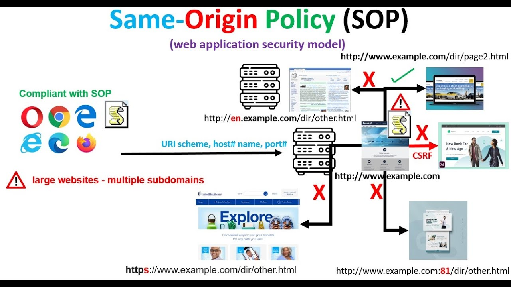
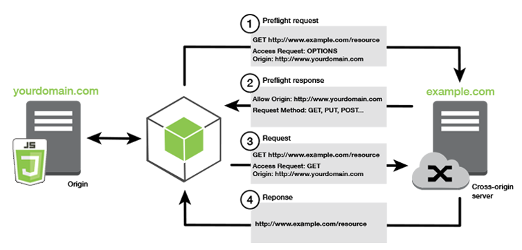
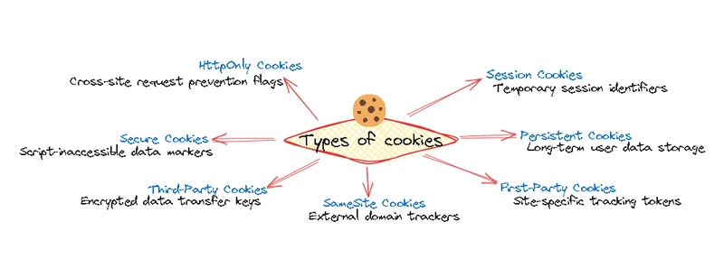

# Basic Security Measures

Before going into the web attacks like injections attacks or logic flaws, it is important to understand how the web is basically designed to secure the data natively. Modern web browsers acts as the first line of the defense, but they rely heavily on the developers explicitly configuring rules and the boundaries. When these rules are misconfigured it arises the vulnerabilities.

Here are the three pillars of web trust.

## 1. The Same Origin Policy (SOP)

The Same Origin Policy is a web browser security mechanism that prevents one website accessing or tampering with other website data. The origin is defined by the URI Scheme, domain and port number and any of these three element is differ they are considered to be different origin. For example, if a two application present in the same IP address but the port differ (that port 80 and port 443) so it could be considered as a different origin.

**Detailed example:**
| URL Accessed                              | Access Permitted?                  |
|-------------------------------------------|------------------------------------|
|  http://normal-website.com/example/       | **Yes**: Same scheme, domain, and port |
|  http://normal-website.com/example2/      | **Yes**: Same scheme, domain, and port |
|  https://normal-website.com/example/      | **No**: Different scheme and port  |
|  http://en.normal-website.com/example/    | **No**: Different domain           |
|  http://www.normal-website.com/example/   | **No**: Different domain           |
|  http://normal-website.com:8080/example/  | **No**: Different port*            |

*Internet Explorer will allow this access because IE does not take account of the port number when applying the same-origin policy.

If any of these three differ the browser considers it a `cross origin` request and by default, will block scripts from reading the response.

### Why is the same-origin policy necessary?

When a browser sends an HTTP request from one origin to another, any cookies, including authentication session cookies, relevant to the other domain are also sent as part of the request. This means that the response will be generated within the user's session, and include any relevant data that is specific to the user. Without the same-origin policy, if you visited a malicious website, it would be able to read your emails from GMail, private messages from Facebook, etc

**The Attacker's Perspective:**
Attackers are constantly looking for ways to bypass SOP to read sensitive data (like CSRF tokens or personal info) from authenticated sessions. If SOP is strictly enforced, an attacker is forced to find a Cross-Site Scripting (XSS) vulnerability to execute code within the trusted origin

**The Prevention Focus**
SOP is a browser enforcement, not a server enforcement. Developers don't "turn it on"; rather, they must understand it so they don't inadvertently introduce vulnerabilities when they legitimately need to bypass it (which leads us to CORS)

> **Note**
The same-origin policy generally controls the access that JavaScript code has to content that is loaded cross-domain. Cross-origin loading of page resources is generally permitted. For example, the SOP allows embedding of images via the ``tag, media via the `<video>` tag, and JavaScript via the `<script>` tag. However, while these external resources can be loaded by the page, any JavaScript on the page won't be able to read the contents of these resources. Still there are various exception in the SOP

## 2. Cross-Origin Resource Sharing (CORS)

Modern web applications rarely exist on a single origin. A frontend at [https://app.mycompany.com](https://app.mycompany.com) often needs to pull data from an API at [https://api.mycompany.com](https://api.mycompany.com). Because the subdomains differ, SOP will block this by default. CORS is the standard way to safely bypass SOP.

CORS uses specific HTTP headers to tell the browser, `It is safe to let this specific outside origin read my data.` When a browser attempts a cross-origin request, it sends an Origin header. The server responds with an Access-Control-Allow-Origin (ACAO) header. If the ACAO header matches the requester's origin, the browser allows the data to be read.

The Attacker's Perspective (CORS Misconfigurations):
Developers often find CORS errors frustrating during development and apply `quick fixes` that create massive vulnerabilities.

The Wildcard (*): Setting Access-Control-Allow-Origin: * tells the browser that any site on the internet can read the data. If this is applied to an endpoint containing sensitive user data, a malicious site can harvest it.

Dynamic Reflection: To support multiple subdomains, a lazy developer might configure the server to read the incoming Origin header and blindly reflect it back in the ACAO header. An attacker can simply send Origin: [https://evil.com](https://evil.com), get approved, and steal data.

**The Prevention Focus**

- Never use * on endpoints that require authentication or serve sensitive data
- Maintain a strict, hardcoded whitelist of allowed origins on the server
- Never blindly reflect the Origin header from the client's request

## 3. Cookie Security Flags

Cookies are the standard mechanism for maintaining state and session identity over the stateless HTTP protocol. If an attacker captures a user's session cookie, they can completely hijack the account. To prevent this, servers must apply security attributes (flags) when setting the cookie.

When a server issues a Set-Cookie header, it should append specific flags to dictate how the browser handles that cookie. That are:

- **Secure**: Tells the browser to only send the cookie over an encrypted HTTPS connection. It prevent network eavesdropping (Man in the Middle Attacks). It stops the cookie from leaking if the user accidentally connects via cleartext HTTP

- **HttpOnly**: Forbids client side scripts (like JavaScript) from accessing the cookie via document.cookie. It prevents massive mitigation against Cross-Site Scripting (XSS). Even if an attacker executes malicious JS on the page, they cannot steal an HttpOnly session token

- **SameSite**: Controls whether the cookie is sent along with cross site requests. it prevents Cross-Site Request Forgery (CSRF)

### Configurations:

- **Strict**: The cookie is only sent if the request originates from the same site. (Maximum security, but can break user flow if they click a link from an external site)

- **Lax**: The cookie is withheld on cross-site subrequests (like images or background API calls) but sent when the user navigates to the origin site (like clicking a link). This is the modern default

- **None**: The cookie is sent with all cross-site requests. (Must be paired with the Secure flag, usually reserved for tracking or advertising cookies)