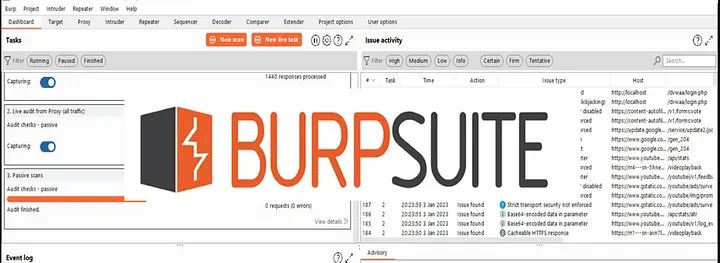
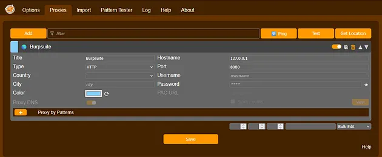
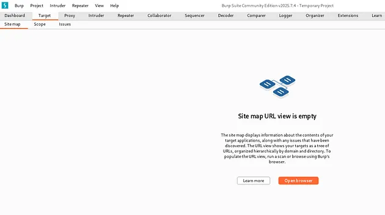
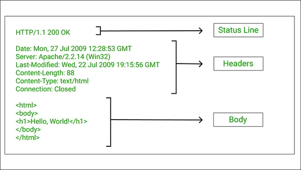

# Web Proxies for web exploitation

Burp Suite and Caido are intercepting web proxies (also called HTTP(S) proxies) primarily used for web application security testing, penetration testing, and bug bounty hunting. They act as a Man in the Middle (MitM) between your browser and the target web application, allowing you to see, analyze, modify, and replay every HTTP/HTTPS request and response as normal browsers hide most of the technical details. These tools give you full visibility and control over the communication, which is essential for security testing.

## What Is Burp Suite?

Burp Suite is developed by PortSwigger, is the Swiss Army knife for web application security testing. It is an integrated platform that allows you to intercept, analyze, and manipulate HTTP/S traffic between your browser and a target web application.

Burp Suite is structured as a collection of tools that all work together in a single interface. The most commonly used ones are: Proxy, Intruder, Repeater, Decoder, Comparer and Sequencer.

### How Burp Suite Intercepts Requests?

At its core, Burp Suite works as a man-in-the-middle (MITM) proxy. When you configure your browser (using something like FoxyProxy, which we will discuss next), all your HTTP and HTTPS traffic is routed through Burp Suite before reaching the target server.

Burp’s Proxy tool then:

- Captures requests sent by your browser.
- Displays them in a readable, editable format.
- Lets you modify and forward them to the target.
- This allows you to see everything happening behind the scenes: cookies, parameters, headers, authentication tokens, and more.

For HTTPS, Burp uses its self-signed SSL certificate to decrypt the traffic, allowing full visibility into even `secure` data streams.

### How to install Burp Suite?

- Visit [Burpsuite download](https://portswigger.net/burp/communitydownload)
- Enter your email then click “download”
- Install it on your desktop

### What Is FoxyProxy?

Manually changing proxy settings in your browser is painful. FoxyProxy is a browser extension that makes it simple to switch between proxy configurations. 

**For example:**

- Turn on Burp Suite proxy when testing.
- Turn it off to browse normally.
- It acts as a traffic director, automatically routing certain requests through Burp and others directly to the internet. It is lightweight, essential, and saves time during testing.

### How to configure FoxyProxy?

- Open Firefox , visit [foxyproxy extension](https://addons.mozilla.org/en-US/firefox/addon/foxyproxy-standard/) and Click on Add to Firefox then it added to the firefox.

- Click the FoxyProxy icon → Options (or right-click the icon → Manage extensions → Options for FoxyProxy).

- Click Add (to create a new proxy):
Title: Burpsuite
Proxy Type: HTTP (or HTTP/HTTPS)
IP address / Hostname: 127.0.0.1
Port: 8080 (Burp's default).
Save the profile

- After setuping the proxy the web browser block or asks the permission to accept the data transmission to burpsuite. So we need Install Burp’s CA certificate in Firefox (for HTTPS interception) and visit 127.0.0.1:8080 on your browser, then click on CA Certificate. Export in DER or PEM format.
- In Firefox: Menu (☰) → Settings → Privacy & Security → scroll to Certificates → View Certificates → Authorities → Import.
- Select the Burp CA file you saved and trust it to identify websites (tick the box for website identification). Click OK.
- Now Firefox will accept Burp’s on-the-fly HTTPS certificates and won’t block intercepted TLS.
- Now the proxies works fine, we can test it by making request to the desired website with the burpsuite on

### Another option

you can intercept by opening browser directly from site map

### The Core Tools

#### Proxy

Burp’s Proxy sits between your browser and the web server and acts as a man-in-the-middle debugger. Every request and response flows through it so you can:

- Intercept traffic in real time (pause a request, edit it, then forward)
- Inspect raw requests/responses, view parsed parameters, and see binary bodies
- Modify on the fly (change headers, tamper with cookies, alter JSON, etc.)
- Record session history and filter by host, MIME type, or status code. 

Use cases: capture login flows, strip authentication headers to test access control, replay sequences to reproduce bugs.

#### Intruder

Intruder automates sending many variants of a request so you can fuzz inputs and enumerate weaknesses.

Modes:

- Sniper: one insertion point, many payloads (good for pinpointing a single parameter).
- Battering ram: same payload applied to all positions simultaneously (fast brute force).
- Pitchfork: parallel lists of payloads across multiple positions (synchronized fuzzing).
- Cluster bomb: Cartesian product of payload lists (exhaustive multi-parameter testing).

Use cases: credential brute-force, parameter fuzzing, discovering hidden parameters or IDs. Watch response length, status codes, and timing differences for signals.

#### Repeater

Repeater is where you iterate, tweak, and learn. Send a captured request to Repeater, change a parameter or header, resend, and observe the server’s reaction.

It is mainly used

- Tight feedback loop for testing XSS payloads, SQLi payloads, or API parameter permutations.
- No automation noise manual control, step-by-step.
- Useful when you want to craft a single exploit payload precisely.

Think of Repeater as `one request, many mutations.`

#### Decoder

Decoder is a tiny Swiss-army transformer for data formats. Paste in a token, cookie, or payload and apply quick transforms:

- URL / percent encoding
- Base64 encode/decode
- Hex / ASCII conversion
- HTML entity encoding/decoding
- Hashing / XOR (depending on extensions)

Use cases: decode obfuscated tokens, inspect Base64 JSON in cookies, and test different encodings for input sanitization bypasses.

#### Comparer

Comparer lets you drop two items (requests, responses, or parts of them) and see a diff. It highlights byte/character differences and helps you answer questions like:

- “How did the server response change after I toggled that header?”
- “Which bytes in the session token changed between requests?”

Use cases: detect tiny differences in error messages, response bodies, or tokens that might leak information (lengths, offsets, data structure changes).

#### Sequencer

Sequencer analyzes randomness and predictability in tokens (session IDs, anti-CSRF tokens, etc.). Feed it many samples and it calculates statistics:

- Entropy and distribution of bytes
- Biases, repeated bytes, or insufficient randomness

It predicts the weak or predictable tokens which leads to session hijacking, token forging, or replay attacks. Sequencer tells you whether a token looks cryptographically strong or suspiciously handcrafted.

### HTTP headers and cookies

When you intercept traffic with Burp, what you see in the proxy is not just raw text and it is the protocol surface that defines how requests and responses behave. Understanding headers and cookies is essential for meaningful tests.

HTTP Request headers (what the client sends)

Common request headers:

- Host: example.comwhich virtual host the request is for (mandatory for HTTP/1.1).
- User-Agent: ... identifies the client; can be changed to test server behavior differences.
- Accept: ... / Accept-Language what formats the client accepts.
- Content-Type: application/jsonserver uses this to parse the body. Changing it may cause parsing errors or bypasses.
- Authorization: Bearer <token>credentials: sensitive, often abused if leaked.
- Cookie: session=abcd; theme=darksession/session-like values that maintain state.
- Referer: can leak origin information; useful for CSRF/SSR checks.
- X-Forwarded-For or X-Real-IP proxied client IPs; occasionally trusted by servers and exploitable for access control bypass.

In Burp: you can edit any header before forwarding. Test what happens when you remove, add, or change these headers.

### HTTP Response headers

Important response headers and security relevance:

- Set-Cookie: session=abcd; HttpOnly; Secure; SameSite=Strict; Path=/ sets client cookies (attributes matter!).
- Cache-Control, Expires caching directives and misconfigured cache can leak private data.
- Content-Security-Policymitigates XSS if present and correctly configured. Weak or absent CSP = more XSS risk.
- Strict-Transport-Security forces HTTPS for a domain; absence can enable downgrade attacks.
- X-Frame-Options / Frame-Options clickjacking protection.
- X-Content-Type-Options: nosniffprevents content sniffing attacks.

Use Burp to see headers in the raw view, and tamper with responses in the proxy (via intercept or by saving/resending with Repeater) to test client-side defenses

## Alternatives

While Burp Suite dominates the field, it is not alone, there are much alternatives like Caido and the OWASP ZAP which is also perform during the web exploitation

